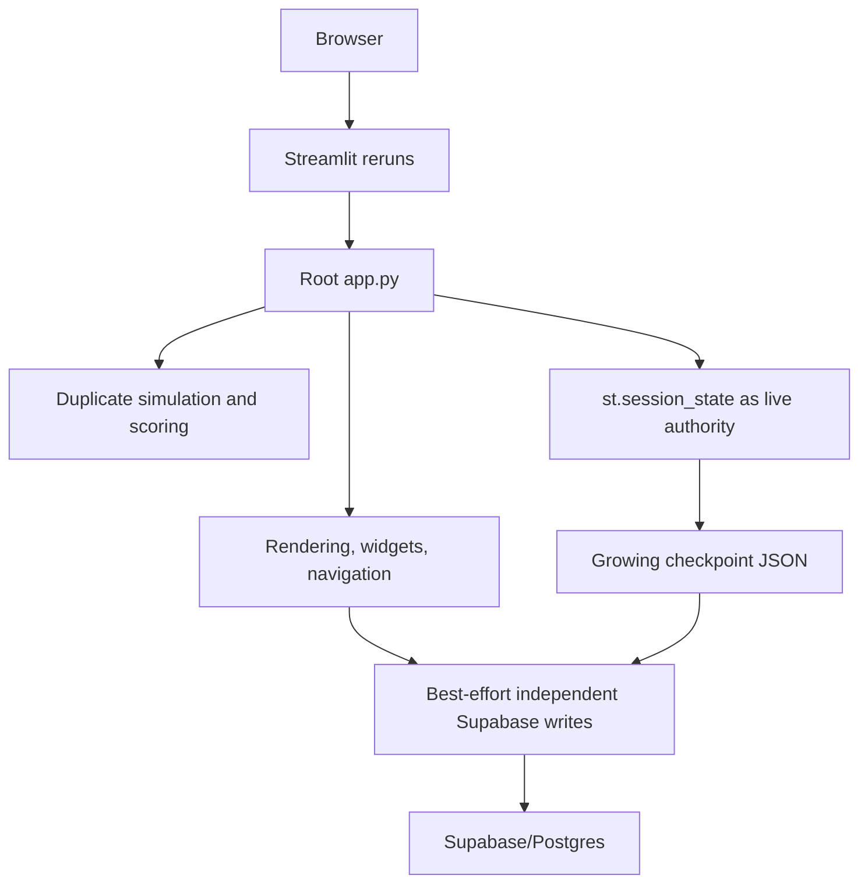
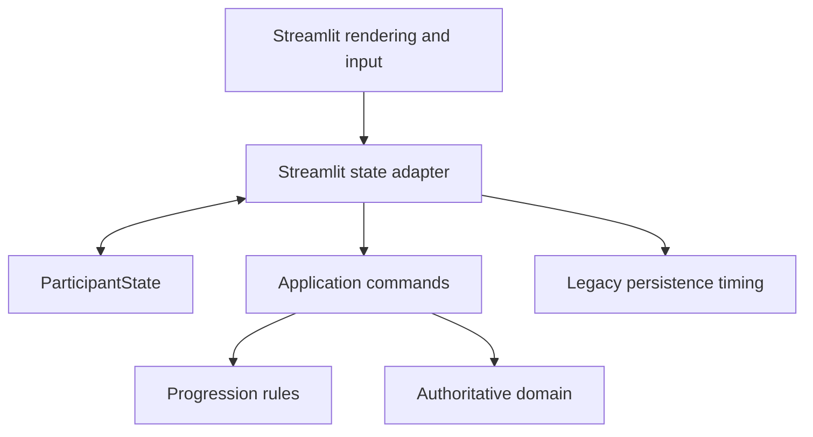
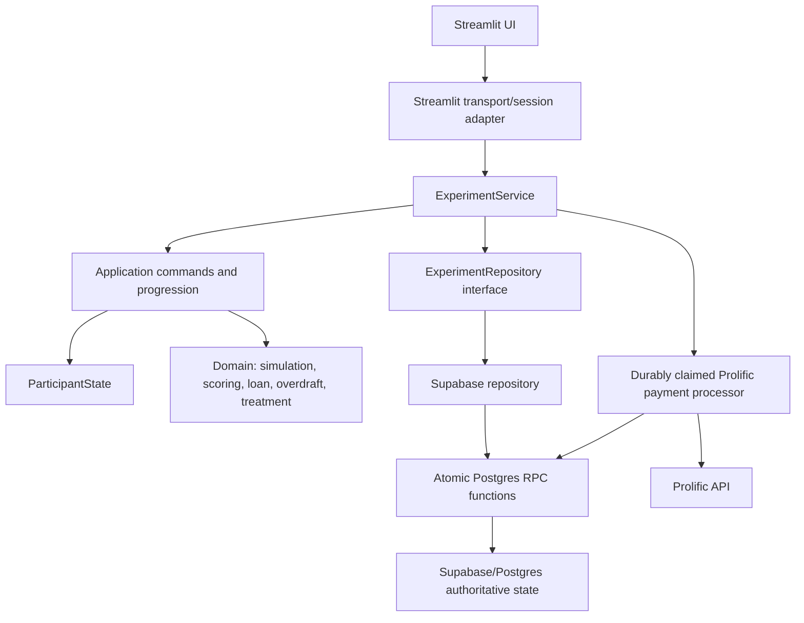

# Behavioral Credit Simulator Migration Specification

Status: Phases 1, 2, and 3 implemented. FastAPI has not been introduced.

Last verified: 2026-08-10

This document is the migration contract and implementation record for separating the behavioral credit simulator from Streamlit while preserving its research semantics. Domain behavior is immutable across these phases unless a later, separately approved research change says otherwise.

## Invariants Across All Phases

The following behavior remains unchanged:

- all 24 economic scenarios, income, expenses, shocks, and obligations;
- loan and overdraft calculations, interest, limits, balances, and arrears semantics;
- valid and invalid payment outcomes;
- monthly scoring, score normalization, final score, and score breakdown;
- C1-C4 treatment meaning, displayed/hidden feedback, and gain/loss framing;
- deterministic Prolific assignment and admin-selected study conditions;
- performance-bonus thresholds, base reward, payout values, and manual-review economics;
- questionnaire content and ordering;
- participant-visible stage and month order;
- authentication and Prolific launch behavior;
- research output values.

The production economic golden digest is:

```text
17f8a2632d861e432c2cd81f86495c4b75356deaa7b55911c2eca6a53f75ab43
```

## Architecture Before Migration



The root application combined bootstrap, presentation, progression, domain calculations, mutable participant state, and persistence choreography. Monthly results accumulated in checkpoint JSON and were not durably structured per month until late in the experiment. Independent writes allowed UI state, monthly rows, summary data, and completion state to diverge.

---

# Phase 1 — One Authoritative Domain Implementation

## Goal

Make `sim_app.domain` the only implementation of economic, scoring, treatment, and payment rules used by production Streamlit.

## Required Separation

`sim_app.domain` owns:

- monthly financial preview and result calculation;
- loan and overdraft behavior;
- monthly scoring and normalization;
- final-score and score-breakdown calculation;
- condition configuration and treatment framing;
- performance-bonus calculation.

Streamlit owns only presentation of those results. Production behavior in the former root `app.py` was the parity reference wherever extracted modules differed.

## Implementation Record

The authoritative modules are:

- `sim_app/domain/simulation.py` — opening balance, month preview, payment validation, and committed month result;
- `sim_app/domain/scoring.py` — monthly score, normalization, final score, breakdown, and session bonus values;
- `sim_app/domain/loan.py` — loan balance, interest, required payment, and payment application;
- `sim_app/domain/overdraft.py` — overdraft balance, limit, interest, deficit coverage, and repayment behavior;
- `sim_app/domain/experimental_conditions.py` — C1-C4 configuration, framing, feedback visibility, and performance-bonus thresholds.

The duplicate root implementations removed from `app.py` included:

- `money`, `month_sum`, and `get_opening_balance`;
- `zero_score_data`, `compute_monthly_score`, and `normalize_month_result_score`;
- `compute_month_result`;
- `compute_final_score` and `get_final_score_breakdown`;
- the root bonus maximum calculation.

UI formatting functions were retained under `sim_app.ui` because they are presentation concerns. Production simulation pages import domain functions directly or call application commands that do so.

## Phase 1 Acceptance Evidence

- all 24 months are covered by the golden journey;
- C1-C4 produce the same underlying economics;
- loan closure, overdraft, invalid payment, score, and bonus boundaries are tested;
- the production digest remains exactly unchanged;
- root `app.py` no longer defines financial or scoring behavior.

---

# Phase 2 — Framework-Neutral State and Experiment Orchestration

## Goal

Extract participant state and progression from `st.session_state`, page handlers, `goto()`, and `st.rerun()` without replacing Streamlit or changing legacy persistence timing.

## Target Boundary



## ParticipantState

`sim_app/application/state.py` defines the framework-neutral `ParticipantState`. It represents:

- scenario and state versions;
- application session UUID;
- current page and month;
- admin study/session/participant references;
- Prolific identity, launch, completion, and redirect values;
- immutable treatment fields;
- loan, overdraft, score, cumulative cost, and payment values;
- pending and completed monthly results;
- questionnaire and demographic answers;
- comprehension and attention-check state;
- final score, summary, payment, saved, and completion state;
- UI resume fields needed across Streamlit reruns.

`ParticipantState.from_checkpoint()` and `to_checkpoint()` preserve the legacy checkpoint representation for compatibility and migration tests. `from_runtime_state()`, `to_runtime_defaults()`, and the Streamlit adapter translate between framework state and the model.

## Application Commands and Progression

`sim_app/application/commands.py` owns state transformations for:

- consent and demographics;
- pre/post questionnaire progression;
- instructions, profile, comprehension, and quality results;
- study/treatment binding;
- monthly decision calculation;
- feedback acknowledgment;
- final-score calculation and completion preparation.

`sim_app/application/progression.py` owns explicit next-stage and route-guard rules, including month 24 to post-questionnaire and final-score to done transitions.

The UI pages collect widget values, call commands, apply returned state, and rerun. Core page sequencing and economic mutation no longer live in page renderers.

## Root Application Result

`app.py` is reduced to:

- Streamlit configuration and styles;
- authentication/launch gate;
- dependency construction;
- participant bootstrap;
- thin commit/navigation callbacks;
- UI context construction and route dispatch.

## Phase 2 Acceptance Evidence

- checkpoint to `ParticipantState` to checkpoint round-trip is tested;
- the full framework-neutral progression from consent through month 24 and done is tested;
- blocked/redirected stages are tested;
- normal decision and feedback steps use application commands;
- Streamlit remains runnable;
- no FastAPI or HTTP route exists.

---

# Phase 3 — Persistence and Concurrency Hardening

## Goal

Replace live Streamlit authority and best-effort writes with:

```text
authoritative database state
→ explicit application transition
→ atomic, versioned, idempotent persistence
→ returned committed state
```

Participant-visible behavior remains `simulation → submit → feedback → acknowledge → next month`, while persistence timing and schema deliberately change to protect research integrity.

## Architecture After Phase 3



## Persistence Invariants

The implemented boundary guarantees:

1. `(session_id, month_number)` has one structured result.
2. Month commits require the authoritative current month and simulation stage.
3. One version can advance only once.
4. A repeated request ID with the same payload returns the committed outcome.
5. A repeated request ID with a different payload conflicts.
6. Stale versions cannot overwrite current state.
7. Failed atomic writes return no advanced participant state.
8. Read failure is distinct from not found and blocks bootstrap.
9. Treatment cannot be changed after binding.
10. Feedback acknowledgment never recomputes the month.
11. Final score is verified against the structured 24-month ledger.
12. Internal finalization is atomic and safely repeatable, including after refresh with a new request key.
13. Prolific side effects are claimed durably before the external call and are never repeated after an uncertain outcome.
14. Legacy checkpoint history is validated and backfilled idempotently.
15. Completed participant state cannot be changed by a normal stage transition.

## ExperimentService

`sim_app/application/services.py` is the framework-neutral transport boundary. Its public operations are:

- `find_session(session_id)` — distinguish absent state from persistence failure;
- `load_session(session_id)` — load authoritative state or raise `SessionNotFound`;
- `create_session(state, account_key, request_id)` — atomically claim participant/resume identity;
- `save_stage(proposed_state, expected_version, request_id)` — persist a versioned non-economic transition;
- `save_quality_transition(...)` — atomically persist quality events and their progression state;
- `submit_month_decision(...)` — calculate through the existing domain and atomically commit one month;
- `acknowledge_month_feedback(...)` — idempotently clear feedback and advance without recalculation;
- `finalize(...)` — atomically persist internal research completion, then coordinate the durable Prolific lifecycle.

No method imports Streamlit or Supabase query syntax. A future transport must call this same service rather than reproduce its validation or persistence choreography.

## Optimistic Concurrency and Conflicts

`participant_sessions.state_version BIGINT NOT NULL` is the authoritative optimistic-lock value. Every participant mutation receives `expected_version`, locks the participant row, verifies the version/stage/month, writes, and increments the version in one database transaction.

Conflicts surface as `ConcurrencyConflict`, `TreatmentConflict`, or `IdempotencyConflict`. The Streamlit adapter reloads the authoritative session and stops optimistic progression.

## Idempotency

`experiment_idempotency` stores `(session_id, operation, request_id)`, a SHA-256 payload hash, and the committed response. Its primary key enforces request uniqueness in Postgres.

The Streamlit adapter derives a deterministic UUID request ID from the logical operation and payload and retains it in session state. A response-lost retry therefore reuses the same key. Idempotency is database-backed, not process memory.

Month decisions additionally store `decision_request_id`, and quality events store `request_id + event_index`. Finalization stores its request ID in the participant and summary records.

## Authoritative Data Model

| Concern | Authoritative source |
|---|---|
| Participant stage, month, balances, totals, version | `participant_sessions` structured columns |
| Completed monthly economics and scores | one `month_results` row per month, including exact `result_json` |
| Treatment | bound columns in `participant_sessions`, protected by trigger/application validation |
| Questionnaire resume state | reduced checkpoint projection until final structured answer commit |
| Quality events | `quality_checks`; quality counters also live in participant columns |
| Final score and research summary | `session_summaries`, verified from `month_results` |
| Completion | participant status/completion columns plus `completed_accounts` |
| Prolific payment/manual review | `prolific_payment_attempts` plus summary and participant lifecycle columns |
| Idempotent transition result | `experiment_idempotency` |

## Checkpoint Role

The checkpoint is now a resume/UI projection. It contains page, language, answers, transient scroll/navigation state, quality counters, UI payment inputs, and Prolific completion navigation values.

It no longer carries authoritative:

- completed monthly history;
- pending economic result;
- balances, scores, or accumulated costs;
- treatment assignment;
- final score or completion status.

`to_checkpoint()` remains available solely to read and validate legacy payloads. Production writes use `to_resume_projection()`.

## Monthly Transaction

Before Phase 3:

```text
mutate Streamlit state
→ checkpoint write
→ show feedback
→ mutate/advance
→ second checkpoint write
→ month 24 bulk result save
```

After Phase 3:

```text
submit payment + expected version/month + request ID
→ load authoritative state
→ validate version, month, stage, treatment, completion, request
→ run unchanged domain calculation
→ commit_month_decision_v3 transaction:
     insert exact structured month result
     update balances, totals, pending feedback, page
     increment state version
     store idempotent response
→ return/reload committed state
→ render feedback
```

Feedback acknowledgment is a separate `acknowledge_month_feedback_v3` transaction. It requires the durable result, clears pending feedback, advances the month, increments the version, and does not execute simulation or scoring.

## Schema Migration

`migration_phase3_persistence_hardening.sql` is additive and must run after `setup.sql` and `migration_structured_results.sql`.

Participant additions:

- `state_version`, `current_month`;
- structured loan/overdraft balances, score, monthly points, and accumulated costs;
- `pending_month_number`, `treatment_bound`, `completion_status`;
- finalization request and transition timestamps;
- range/status checks.

Monthly-result additions:

- loan balance before payment;
- exact `result_json`;
- decision request ID and committed version;
- unique request index while retaining the existing per-session/month key.

Other additions:

- `experiment_idempotency` table and index;
- `prolific_payment_attempts` table;
- summary finalization/payment request columns and unique index;
- quality-check request/event columns and unique index;
- treatment immutability trigger.

Atomic database functions:

- `claim_participant_session_v3`;
- `commit_stage_transition_v3`;
- `commit_quality_transition_v3`;
- `commit_month_decision_v3`;
- `acknowledge_month_feedback_v3`;
- `backfill_legacy_session_v3`;
- `finalize_experiment_v3`;
- `claim_prolific_payment_v3`;
- `finish_prolific_payment_v3`.

Functions are `SECURITY DEFINER`, have a fixed `search_path`, are revoked from `PUBLIC`, and are granted to `service_role`.

## Legacy Session Migration

On load, a legacy checkpoint containing `monthly_results` or `pending_month_result` triggers `backfill_legacy_session_v3`.

The migration:

- locks the participant;
- requires consecutive months beginning at 1;
- inserts only missing structured rows;
- compares existing exact JSON or core structured values and rejects a mismatch;
- incorporates a pending committed-feedback month once;
- hydrates structured balances, totals, month, treatment binding, and quality counters;
- replaces the growing checkpoint with a reduced projection;
- increments the state version only when migration/hydration occurs;
- is a no-op on the next load.

Treatment remains unbound for a legacy participant who has not selected a study session and has not begun an economic month. Once economics or an identity assignment exists, it is durably bound.

## Identity and Session Claims

Session creation uses an advisory transaction lock on the account key and the unique `resume_links` constraints. Prolific participant/study uniqueness and admin participant-code uniqueness remain database enforced. Concurrent uniqueness failures are surfaced as application conflicts rather than retried as last-write-wins updates.

Bootstrap treats a known-but-missing linked session as an error. Any database/network exception stops bootstrap without installing default participant state.

## Finalization and Prolific Safety

`finalize_experiment_v3` atomically:

- verifies 24 structured months and the ledger-derived final score;
- saves pre/post psychometric answers, demographics, feedback, and the session summary;
- marks participant/account completion;
- removes the resume link;
- seeds a durable Prolific payment attempt when applicable;
- stores the idempotent response and increments the version.

External Prolific work occurs after internal commit:

```text
pending → processing → succeeded
                    ↘ manual_review
pending → not_configured
```

Claiming and terminal state updates are atomic RPCs. A timeout or a recovered `processing` attempt is moved to manual review without repeating the external request. A successful Prolific transition retains the existing awaiting-approval/manual-review semantics. Internal completion remains committed if external processing needs retry or reconciliation.

## Shared Supabase Resource

`sim_app/infra/supabase.py` creates one credential-keyed client per process under a lock. `sim_app/infra/secrets.py` is framework-neutral; `sim_app/session/streamlit_secrets.py` injects Streamlit secrets at composition time. Repositories and tests may inject a client directly.

## Instrumentation

`sim_app/application/instrumentation.py` provides lightweight structured logging and in-process counters for:

- application operation count and aggregate latency;
- database operation latency and request count per operation;
- monthly decision commit latency;
- finalization including payment processing;
- checkpoint/resume payload bytes;
- conflict count;
- idempotency-hit count.

This is measurement scaffolding, not a replacement for deployment-level metrics or load testing.

## Files Added

| File | Responsibility |
|---|---|
| `sim_app/application/state.py` | Framework-neutral participant model and legacy/resume serialization |
| `sim_app/application/progression.py` | Explicit route and next-stage rules |
| `sim_app/application/commands.py` | Framework-neutral participant state transformations |
| `sim_app/application/services.py` | Authoritative application/use-case boundary |
| `sim_app/application/repositories.py` | Repository contract and committed result type |
| `sim_app/application/errors.py` | Explicit not-found, read, write, transition, concurrency, treatment, and idempotency errors |
| `sim_app/application/instrumentation.py` | Lightweight latency/counter hooks |
| `sim_app/persistence/experiment_repository.py` | Supabase reads and atomic RPC implementation |
| `sim_app/persistence/memory.py` | Transactional test repository with failure injection |
| `sim_app/persistence/payment_processor.py` | Durable Prolific side-effect coordinator |
| `sim_app/session/service_provider.py` | Process-level ExperimentService composition |
| `sim_app/session/streamlit_state.py` | ParticipantState/Streamlit mapping |
| `sim_app/session/streamlit_service.py` | Thin committed-state Streamlit transport adapter |
| `sim_app/session/streamlit_secrets.py` | Streamlit secrets adapter |
| `migration_phase3_persistence_hardening.sql` | Additive constraints, tables, indexes, trigger, and transactional functions |
| `tests/test_application_refactor.py` | Phase 1/2 golden, serialization, progression, and adapter parity tests |
| `tests/test_phase3_persistence.py` | Persistence/concurrency/failure/idempotency/finalization tests |

## Files Removed

The following unused best-effort write paths were removed after repository-wide usage searches showed no production callers:

- `sim_app/persistence/participation.py`;
- `sim_app/persistence/results.py`;
- `sim_app/persistence/quality.py`;
- `sim_app/state/snapshots.py`;
- `sim_app/persistence/client.py` compatibility re-export;
- `sim_app/prolific/flow.py` compatibility wrapper.

Legacy checkpoint reads remain read-only. Participant writes no longer use an unversioned checkpoint upsert.

No files were moved or renamed.

## Streamlit Responsibilities Remaining

Streamlit still owns:

- widget rendering and input collection;
- CSS/HTML presentation;
- OIDC/login UI and account menu;
- browser query parameters and Prolific launch parameters;
- reruns, stop behavior, and session-local request-ID retention;
- applying returned committed `ParticipantState` for rendering;
- admin study-session screens.

Streamlit no longer owns participant economics, core progression rules, participant write choreography, month-result persistence, concurrency validation, finalization choreography, or authoritative participant history.

## Test and Verification Record

Commands executed:

```powershell
D:\anaconda\python.exe -m compileall -q app.py sim_app tests
D:\anaconda\python.exe -m pytest -p no:cacheprovider -q
git diff --check
rg -n -i "fastapi" . --glob "*.py" --glob "!.git/**" --glob "!.codex-remote-attachments/**"
rg -n "import streamlit|from streamlit" sim_app\application sim_app\domain sim_app\persistence sim_app\infra
D:\anaconda\python.exe -m streamlit run app.py --server.headless true --server.port 8502 --browser.gatherUsageStats false
```

Results:

- 81 tests passed;
- economic golden digest exactly matched;
- compile check passed;
- `git diff --check` reported no whitespace errors;
- no FastAPI code/import references were found;
- no Streamlit imports were found in application, domain, persistence, or infrastructure packages;
- headless Streamlit reached a listening state successfully.

## Deployment and Downgrade Plan

Recommended deployment order:

1. Back up the production database and record active participant counts/stages.
2. Apply `migration_phase3_persistence_hardening.sql` before deploying the Phase 3 application.
3. Verify functions, indexes, trigger, and service-role grants in the target Supabase project.
4. Deploy the application as one replica first.
5. Exercise a test session through decision, feedback, resume, and completion.
6. Verify one structured row per committed month and inspect operation metrics.
7. Run concurrency/load tests before adding replicas.

For downgrade, deploy the Phase 2 application first. Do not delete `month_results`, idempotency, or payment-attempt data. Additive columns and RPCs may be removed only after confirming that no active session has a Phase 3 version and no payment attempt is pending or processing. The SQL migration includes matching downgrade notes.

### Destructive Development Reset

Two Supabase SQL Editor scripts are provided for an explicitly destructive application-data reset:

- `supabase_drop_all_app_tables.sql` drops only simulator-owned tables and RPCs, including historical simulator tables. It does not drop the `public` schema, Supabase Auth, Storage, extensions, or unrelated tables.
- `supabase_regenerate_all_app_tables.sql` is a standalone rebuild containing the exact canonical `setup.sql`, structured-results migration, and Phase 3 migration in order.

The drop script permanently deletes participant and research data. It must not be run against production without a verified backup and explicit data-retention approval.

## Remaining Risks and Required Live Validation

- The migration was statically reviewed and tested by contract, but was not executed against the live Supabase/Postgres schema in this workspace.
- Supabase/PostgREST error shapes, permissions, RPC parameter resolution, and RLS behavior require staging integration tests.
- No real Prolific payment was sent; timeout and accepted responses were tested with fakes.
- No 50-500 participant load test was performed. The instrumentation is ready for that measurement.
- Process-local metrics reset on restart and need collection by the deployment environment for longitudinal analysis.
- Admin study-session operations remain direct repository-style Supabase operations because they are outside participant economic progression; they still require staging concurrency checks.

## FastAPI Readiness

FastAPI remains absent. A future API transport only needs to:

- authenticate/resolve an account and session;
- translate request payloads into `ExperimentService` calls;
- provide `expected_version`, expected month/stage, and idempotency keys;
- map service success/conflict/not-found/persistence errors to HTTP responses;
- serialize committed `ParticipantState` and feedback;
- leave domain calculations, progression, repository calls, concurrency, and finalization inside the existing service boundary.

The API must not directly call Supabase or reproduce transition rules.

## Phase 3 Definition of Done

- [x] Domain digest unchanged.
- [x] Failed persistence cannot advance the participant.
- [x] Read failure cannot initialize/reset a participant.
- [x] Every committed month immediately creates one structured result.
- [x] Monthly decision commit is atomic and idempotent.
- [x] Stale/concurrent submissions cannot both commit.
- [x] Treatment is immutable after binding.
- [x] Feedback acknowledgment cannot recompute economics.
- [x] Quality events and their progression commit atomically.
- [x] Internal finalization is atomic and retry-safe.
- [x] Prolific external work cannot duplicate after retry/uncertain outcome.
- [x] Streamlit calls framework-neutral `ExperimentService`.
- [x] Persistence has no Streamlit dependency.
- [x] Supabase client lifecycle is centralized.
- [x] Legacy sessions have an idempotent validated backfill path.
- [x] Streamlit starts successfully.
- [x] Full tests pass.
- [x] FastAPI remains absent.

# Phase 3.5 — Real Supabase Integration Verification and Release

## Goal

Prove the Phase 3 persistence architecture against the configured real Supabase/Postgres project through the production path:

```text
ExperimentService
    -> ExperimentRepository
    -> Supabase Python client
    -> PostgREST/RPC
    -> PostgreSQL
```

Phase 3.5 is an infrastructure-verification and release phase. It must not alter domain economics, scoring, treatment semantics, questionnaire order, participant-visible progression, payment economics, application boundaries, or introduce FastAPI. Production code may change only when a real integration failure demonstrates a concrete defect, and every such fix requires a regression test.

The configured database was declared intentionally free of participant and research records before this phase. Synthetic test records may be created and deleted when scoped to generated integration-test identities. Real Prolific payments are prohibited.

## Required Access and Safety

Execution requires all of the following without committing or logging credential values:

- the Supabase project URL;
- a server/service-role credential for privileged repository RPCs;
- an authorized SQL migration path, such as authenticated Supabase SQL Editor access or a direct database migration credential;
- local Prolific behavior replaced by the existing fake/stub processor for payment-lifecycle verification.

Local credential files must remain ignored. `.codex-remote-attachments/` is user-owned and must remain untouched and untracked. No reset, clean, history rewrite, force push, unrelated schema drop, or real payment side effect is allowed.

## Schema and RPC Verification

Inspect the real schema before migration and establish the repository migrations in order only where required:

1. `setup.sql`;
2. `migration_structured_results.sql`;
3. `migration_phase3_persistence_hardening.sql`.

Verify table columns, types, keys, constraints, indexes, foreign keys, RLS, functions, and triggers for participant state, monthly results, identity/resume records, completion records, quality events, questionnaire answers, and admin study sessions.

Verify the real signatures, JSON return shapes, fixed search paths, `SECURITY DEFINER` settings, and grants for:

- `claim_participant_session_v3`;
- `commit_stage_transition_v3`;
- `commit_quality_transition_v3`;
- `commit_month_decision_v3`;
- `acknowledge_month_feedback_v3`;
- `backfill_legacy_session_v3`;
- `finalize_experiment_v3`;
- `claim_prolific_payment_v3`;
- `finish_prolific_payment_v3`.

`PUBLIC` must not execute privileged transitions, while the intended service role must be able to execute them. Permissions must not be weakened to make tests pass.

## Real Integration Test Contract

Add a separate, explicit-opt-in real integration suite using unique synthetic identifiers and cleanup limited to those identifiers. It must exercise the production service/repository/client/RPC path and verify:

- session creation, resume identity claim, treatment binding, and competing identity claims;
- one atomic month-result commit and exact Python-domain/database value parity;
- identical request retry, response-lost retry, and same-key/different-payload conflict;
- several genuinely concurrent same-version decisions where exactly one wins;
- stale-version rejection with no state overwrite;
- feedback acknowledgment without economic recomputation;
- explicit not-found versus transport/read-failure behavior;
- database-enforced treatment immutability;
- atomic and idempotent quality/comprehension progression;
- idempotent synthetic legacy checkpoint backfill and mismatch rejection;
- a complete real-database 24-month journey with exactly months 1 through 24;
- ledger-derived final score and atomic, retry-safe internal finalization;
- real database payment-attempt lifecycle using only a fake external Prolific processor;
- actual PostgREST argument serialization, response shapes, and error mapping;
- process-level Supabase client reuse and real-operation instrumentation.

The 24-month economic digest must remain exactly:

```text
17f8a2632d861e432c2cd81f86495c4b75356deaa7b55911c2eca6a53f75ab43
```

## Verification and Release Gate

Before release, run:

```powershell
D:\anaconda\python.exe -m compileall -q app.py sim_app tests
D:\anaconda\python.exe -m pytest -p no:cacheprovider -q
git diff --check
D:\anaconda\python.exe -m streamlit run app.py --server.headless true --server.port 8502 --browser.gatherUsageStats false
```

Run the real Supabase suite separately with its explicit opt-in safety configuration. Also audit for FastAPI, Streamlit imports below the adapter layer, direct participant writes outside the repository/service boundary, unversioned checkpoint writes, and duplicate domain implementations.

Only after all applicable real-integration checks pass may the Phase 1–3.5 changes be staged, committed as `refactor: harden simulator architecture and transactional persistence`, and pushed normally to the current branch/upstream. Never force push.

## Phase 3.5 Execution Record — 2026-08-10

Status: **blocked before migration; not complete and not released**.

Verified safely:

- starting branch: `master`;
- starting commit: `a47ea9a7f03fbd58d0811c863b54e4ec460cec68`;
- remote: `origin` at the existing GitHub repository;
- Phase 1–3 changes were still uncommitted;
- `.codex-remote-attachments/` remained untouched and untracked;
- `.streamlit/secrets.toml` is protected by `.gitignore`;
- the configured Supabase endpoint is reachable;
- the nine required application tables queried through the configured client and returned zero visible rows;
- the configured credential is an anonymous JWT, not a service-role/server credential;
- Supabase rejected privileged schema metadata access with that credential;
- no local Supabase CLI, `psql`, direct database URL, or separate migration credential was available;
- the available in-app Supabase dashboard session was not authenticated.

Consequently, the schema migration, service-role RPC verification, destructive synthetic integration setup, real transaction/concurrency tests, release commit, and push were not performed. This is intentional: proceeding with an anonymous credential would require weakening permissions or bypassing the required server-side boundary.

To resume Phase 3.5, configure a service-role/server credential locally (for example `SUPABASE_SERVICE_ROLE_KEY` or `SUPABASE_SECRET_KEY`) and provide an authorized migration path. Do not paste credential values into this specification or commit them. Once access exists, replace this blocked record with the complete evidence matrix, exact integration commands/results, commit SHA, and push result.

## Phase 3.5 Progress Update — Real Supabase Verification

This update supersedes the earlier credential-access blocker but does not yet mark Phase 3.5 complete.

### Credential and Git Safety

- A local `.env` harness is configured and verified as ignored by `.gitignore`.
- `.env`, `.env.*`, `.streamlit/secrets.toml`, and local credentials remain outside Git.
- `.env.example` documents variable names without containing credential values.
- `scripts/load-integration-env.ps1` loads the test environment while explicitly excluding `PROLIFIC_*` credentials and disabling real Prolific payment paths.
- A Supabase server/secret credential is now available locally and was accepted by the real service.
- No credential value was printed, written to tests/documentation, or staged.

### Real Infrastructure Evidence

- The configured Supabase endpoint is reachable using the server credential.
- PostgREST metadata exposes all required Phase 3 tables and all nine production RPCs with repository-compatible argument names.
- The real schema already contains the Phase 3 participant-state columns, authoritative month ledger additions, idempotency table, and payment-attempt table.
- Real session creation and identity/resume claim succeeded.
- A real month-1 decision created exactly one `month_results` row, advanced version `0 -> 1`, moved the participant to feedback, and matched the Python domain score.
- Identical month submission retry returned the committed response without another row or version increment.
- Reusing the request ID with a different payment raised `IdempotencyConflict` without mutation.
- Feedback acknowledgment advanced version `1 -> 2` and month `1 -> 2` without recomputing or duplicating the month result; its retry was idempotent.
- Real quality transition produced one event and one version increment; its retry produced no duplicate.
- A direct attempt to change a bound treatment was rejected by the live database trigger, leaving treatment unchanged.
- Synthetic legacy state backfilled exactly one structured month, hydrated month 2, and did not change version on a second load.
- A deliberate legacy/durable mismatch was rejected without overwriting structured truth.
- Real not-found behavior remained distinct from injected transport/read-failure behavior.
- Instrumentation recorded application counts/latencies, database request counts/latencies, commit activity, conflicts, and idempotency hits.

### Concurrency Verification

The initial concurrent integration run exposed that the synchronous Supabase/httpx client could not safely share one HTTP/2 connection across worker threads. The resulting transport read failure did not create a second economic commit.

The minimal correction changed client reuse from one process-global synchronous client to one credential-keyed client per worker thread, still reused for all operations on that thread. The framework-neutral repository now resolves the appropriate thread resource rather than caching one client inside the process-global repository.

After correction:

- five manual real-database concurrency trials passed;
- three repeatable formal integration trials passed;
- each trial used two different valid payments, the same session/month/version, and different request IDs;
- each trial produced exactly one success and one `ConcurrencyConflict`;
- each trial left exactly one month row, participant version `N + 1`, feedback stage, unchanged treatment, and financial state matching the winning payment;
- the two worker threads used distinct client resources while each thread reused its own resource.

### Full Real-Database Journey

A complete synthetic participant journey ran through `ExperimentService -> SupabaseExperimentRepository -> PostgREST/RPC -> PostgreSQL` for all 24 months.

- ledger row count: `24`;
- month sequence: exactly `1..24` with no gaps or duplicates;
- final loan balance: `0.0`;
- final overdraft balance: `1836.0`;
- monthly score sum: `2010.67`;
- final score: `83.78`;
- final state version after the final stage and internal finalization: `50`;
- completion account lock count: `1`;
- remaining resume-link count: `0`;
- identical finalization retry returned the existing committed result without duplication.

The real journey's economic digest remained exactly:

```text
17f8a2632d861e432c2cd81f86495c4b75356deaa7b55911c2eca6a53f75ab43
```

### Prolific Safety and Confirmed Manual-Review Semantics

Real Supabase payment-attempt persistence was exercised with a fake local external processor only. Successful and timeout paths each invoked the fake processor once, and retries did not invoke it again. Timeout/uncertain behavior durably entered manual review as intended.

The live integration confirmed the intended research/payment workflow: `payment_manual_review` is the only participant completion state used after the Prolific transition, including when the fake external transition is accepted. The unused success-specific participant state was removed from the migration constraint and tests.

Internal payment-attempt statuses such as `pending`, `processing`, and `succeeded` remain because they prevent duplicate external calls and make retries safe. The `not_applicable` bonus status remains for non-Prolific participants, and `complete` remains the participant completion state for non-Prolific sessions. These internal/non-Prolific values do not replace the Prolific participant outcome of `payment_manual_review`.

**No real Prolific payment was sent.**

### Test Record So Far

```text
compileall: passed
normal suite: 82 passed, 5 real-integration tests skipped
formal real integration subset: 4 passed
formal 24-month real journey/finalization: 1 passed
manual real concurrency trials after client correction: 5 passed
```

The dedicated opt-in suite is `tests/integration/test_real_supabase_phase3.py`. It requires both `RUN_SUPABASE_INTEGRATION=1` and `SUPABASE_INTEGRATION_ALLOW_SYNTHETIC_WRITES=1` and cleans up only generated synthetic identities.

### Remaining Blocker

The configured `SUPABASE_DB_URL` is currently the direct port-5432 endpoint. That endpoint is IPv6-only for this project/network path and times out from the verification environment. Replace it with the Supabase **Connect -> Session pooler -> URI** connection string on port `5432`.

Once the pooler URL is available, the remaining work is:

1. inspect live constraints, triggers, RLS, RPC `SECURITY DEFINER`, fixed `search_path`, and grants through PostgreSQL catalogs;
2. verify the live `finish_prolific_payment_v3` definition preserves the confirmed manual-review-only participant outcome;
3. run the complete six-test real integration suite, including fake-payment success/manual-review assertions;
4. rerun compilation, all regression tests, architecture/secrets audit, `git diff --check`, and Streamlit smoke test;
5. replace the earlier blocked Phase 3.5 record with final evidence;
6. stage only intended files, commit, and push normally.

No commit or push has been performed because the final live SQL correction and security verification are still pending.

# Phase 3.5 Final Verification Record — 2026-08-10

This record supersedes the earlier Phase 3.5 blocked/progress records. Phase 3.5 infrastructure verification is complete.

## 1. Starting Git State

- Branch: `master`.
- Starting commit: `a47ea9a7f03fbd58d0811c863b54e4ec460cec68`.
- Phase 1–3 changes were uncommitted when Phase 3.5 began.
- Existing user changes were preserved; no reset, clean, rebase, or history rewrite was used.
- `.codex-remote-attachments/` remained untouched and untracked.

## 2. Supabase Environment

The project was intentionally empty of participant/research rows before verification. The live schema already contained the expected base, structured-result, and Phase 3 objects. Local `.env` configuration is ignored by Git, and the integration harness strips Prolific credentials from the test process.

## 3. Migration Execution

The base and Phase 3 schema had already been established. PostgreSQL catalog inspection confirmed all required objects. One additive constraint cleanup was applied transactionally after verifying zero rows used the removed value: the unused success-specific participant completion state was removed. The confirmed Prolific participant outcome remains `payment_manual_review`.

## 4. RPC Verification

All nine production RPCs exist and were executed through the real Supabase Python/PostgREST path:

- `claim_participant_session_v3`;
- `commit_stage_transition_v3`;
- `commit_quality_transition_v3`;
- `commit_month_decision_v3`;
- `acknowledge_month_feedback_v3`;
- `backfill_legacy_session_v3`;
- `finalize_experiment_v3`;
- `claim_prolific_payment_v3`;
- `finish_prolific_payment_v3`.

Catalog verification confirmed compatible argument types/order, JSONB return types, `SECURITY DEFINER`, fixed `search_path=public`, `PUBLIC` execute revoked, and `service_role` execute granted for every RPC.

## 5. Integration Bugs Found

One concrete runtime defect was reproduced:

```text
concurrent use of one synchronous Supabase/httpx client
-> HTTP/2 transport read failure
-> synchronous client was not safe to share across worker threads
-> changed to one credential-keyed reusable client per worker thread
-> unit regression plus repeated real concurrency verification
```

The failure did not produce a duplicate economic commit. No domain/economic implementation changed.

## 6. Monthly Commit Verification

A real month-1 decision produced exactly one authoritative row, version `0 -> 1`, and stage `simulation -> month_feedback`. Persisted payment, score, balances, and result JSON matched the Python domain result. Reload reconstructed the committed state.

## 7. Concurrency Verification

Five manual and three formal real-database trials submitted two different valid payments against the same session/month/version. Every trial produced exactly one success and one `ConcurrencyConflict`, exactly one ledger row, version `N + 1`, unchanged treatment, feedback stage, and economic state matching the winner.

## 8. Idempotency Verification

Identical and response-lost-equivalent retries returned the original committed outcome with no second row, mutation, advancement, or version increment. Reusing the same request ID with a different payment raised `IdempotencyConflict` with zero mutation.

## 9. Treatment and Quality Verification

The live treatment-immutability trigger rejected a direct service-role table update and preserved the bound condition. A real quality transition inserted one event and advanced one version atomically; identical retry inserted nothing and did not advance again.

## 10. Legacy Backfill Verification

A synthetic Phase 2 checkpoint with one completed month and no structured row backfilled exactly once, hydrated month 2/economic state, and did not mutate on the second load. A deliberate checkpoint/durable mismatch was rejected without overwriting the structured row.

## 11. 24-Month Real Database Journey

- Structured rows: exactly `24`.
- Month sequence: exactly `1..24`.
- Final loan: `0.0`.
- Final overdraft: `1836.0`.
- Monthly score sum: `2010.67`.
- Final score: `83.78`.
- Golden digest: `17f8a2632d861e432c2cd81f86495c4b75356deaa7b55911c2eca6a53f75ab43`.

## 12. Finalization Verification

Internal finalization validated all 24 rows, stored the summary, completed the participant, created exactly one completed-account lock, removed the resume link, and advanced the version once. Identical retry returned the existing result without duplicate summary/research rows or economic mutation.

## 13. Prolific Safety

Real Supabase payment-attempt persistence was tested with a fake local external processor. Accepted and timeout paths each invoked the fake once; retries did not invoke it again. Participant completion remained `payment_manual_review`, while internal attempt statuses retained the information required to prevent duplicate calls.

**No real Prolific payment was sent.**

## 14. Supabase Client Lifecycle

Credentials and client construction remain centralized outside Streamlit. Each worker thread now receives one reusable credential-keyed synchronous client; repeated operations on that thread reuse object identity, while concurrent worker threads do not share the unsafe HTTP connection.

## 15. Instrumentation

Real operations produced application counts/latencies, database request counts/latencies, monthly commit/finalization timings, conflicts, idempotency hits, and resume/checkpoint payload-byte metrics without logging participant payloads or credentials.

## 16. Regression Test Results

```text
D:\anaconda\python.exe -m compileall -q app.py sim_app tests
result: passed

D:\anaconda\python.exe -m pytest -p no:cacheprovider -q
result: 82 passed, 6 explicitly skipped real-integration tests

powershell.exe -NoProfile -ExecutionPolicy Bypass -Command ". .\scripts\load-integration-env.ps1; D:\anaconda\python.exe -m pytest -p no:cacheprovider -q tests\integration\test_real_supabase_phase3.py"
result: 6 passed

git diff --check
result: passed

Streamlit headless port 8502
result: reached listening state and test process was stopped
```

## 17. Domain Parity

The real database journey and local golden tests both produced exactly:

```text
17f8a2632d861e432c2cd81f86495c4b75356deaa7b55911c2eca6a53f75ab43
```

No scoring, simulation, loan, overdraft, treatment, bonus, questionnaire, or research semantics changed.

## 18. Architecture Verification

- Streamlit remains a UI/transport/session adapter.
- `ExperimentService` remains framework-neutral.
- Supabase syntax remains behind persistence repositories.
- PostgreSQL RPCs own transaction, locking, idempotency, version, and uniqueness enforcement.
- Python domain modules remain the sole economic/scoring implementation.
- No Streamlit imports exist in application/domain/persistence/infra.
- No FastAPI implementation or import exists.

## 19. Remaining Risks

- Supabase SDK emits deprecation warnings for legacy timeout/verify client options; functionality passed and should be revisited only during a future dependency upgrade.
- Full 50/100/200/500 participant load testing remains intentionally deferred until the future API/container transport exists.
- Real Prolific sandbox/live reconciliation still requires an explicitly authorized provider-side validation; this phase deliberately used fakes only.

## 20. Git Commit

The verified tree is committed with `refactor: harden simulator architecture and transactional persistence` on `master`. The resulting SHA is reported in Git metadata and the task's final report rather than embedded here, because a commit cannot contain its own final SHA.

## 21. Push

The verified commit is pushed normally to `origin/master` without force. The exact push result and final working-tree state are reported in the task's final report after the external operation completes.
