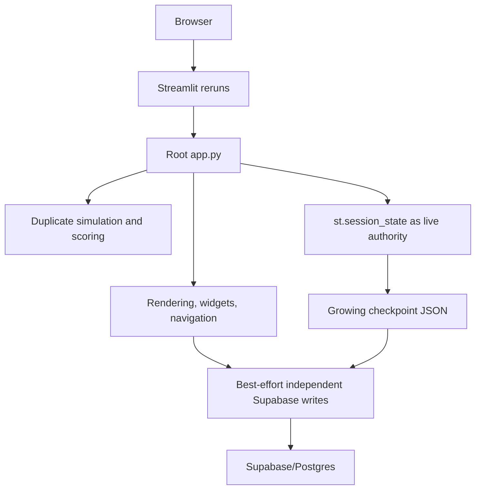
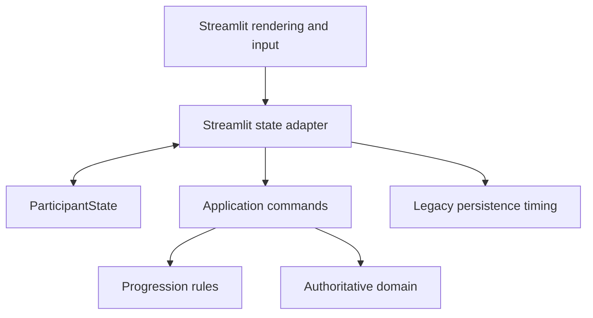
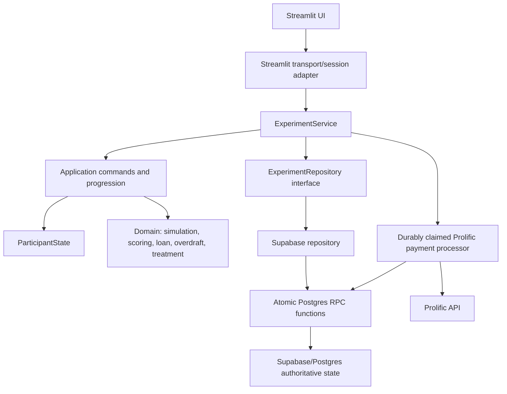

# Behavioral Credit Simulator Migration Specification

Status: Phases 1, 2, and 3 implemented. FastAPI has not been introduced.

Last verified: 2026-08-10

This document is the migration contract and implementation record for separating the behavioral credit simulator from Streamlit while preserving its research semantics. Domain behavior is immutable across these phases unless a later, separately approved research change says otherwise.

## Invariants Across All Phases

The following behavior remains unchanged:

- all 24 economic scenarios, income, expenses, shocks, and obligations;
- loan and overdraft calculations, interest, limits, balances, and arrears semantics;
- valid and invalid payment outcomes;
- monthly scoring, score normalization, final score, and score breakdown;
- C1-C4 treatment meaning, displayed/hidden feedback, and gain/loss framing;
- deterministic Prolific assignment and admin-selected study conditions;
- performance-bonus thresholds, base reward, payout values, and manual-review economics;
- questionnaire content and ordering;
- participant-visible stage and month order;
- authentication and Prolific launch behavior;
- research output values.

The production economic golden digest is:

```text
17f8a2632d861e432c2cd81f86495c4b75356deaa7b55911c2eca6a53f75ab43
```

## Architecture Before Migration



The root application combined bootstrap, presentation, progression, domain calculations, mutable participant state, and persistence choreography. Monthly results accumulated in checkpoint JSON and were not durably structured per month until late in the experiment. Independent writes allowed UI state, monthly rows, summary data, and completion state to diverge.

---

# Phase 1 — One Authoritative Domain Implementation

## Goal

Make `sim_app.domain` the only implementation of economic, scoring, treatment, and payment rules used by production Streamlit.

## Required Separation

`sim_app.domain` owns:

- monthly financial preview and result calculation;
- loan and overdraft behavior;
- monthly scoring and normalization;
- final-score and score-breakdown calculation;
- condition configuration and treatment framing;
- performance-bonus calculation.

Streamlit owns only presentation of those results. Production behavior in the former root `app.py` was the parity reference wherever extracted modules differed.

## Implementation Record

The authoritative modules are:

- `sim_app/domain/simulation.py` — opening balance, month preview, payment validation, and committed month result;
- `sim_app/domain/scoring.py` — monthly score, normalization, final score, breakdown, and session bonus values;
- `sim_app/domain/loan.py` — loan balance, interest, required payment, and payment application;
- `sim_app/domain/overdraft.py` — overdraft balance, limit, interest, deficit coverage, and repayment behavior;
- `sim_app/domain/experimental_conditions.py` — C1-C4 configuration, framing, feedback visibility, and performance-bonus thresholds.

The duplicate root implementations removed from `app.py` included:

- `money`, `month_sum`, and `get_opening_balance`;
- `zero_score_data`, `compute_monthly_score`, and `normalize_month_result_score`;
- `compute_month_result`;
- `compute_final_score` and `get_final_score_breakdown`;
- the root bonus maximum calculation.

UI formatting functions were retained under `sim_app.ui` because they are presentation concerns. Production simulation pages import domain functions directly or call application commands that do so.

## Phase 1 Acceptance Evidence

- all 24 months are covered by the golden journey;
- C1-C4 produce the same underlying economics;
- loan closure, overdraft, invalid payment, score, and bonus boundaries are tested;
- the production digest remains exactly unchanged;
- root `app.py` no longer defines financial or scoring behavior.

---

# Phase 2 — Framework-Neutral State and Experiment Orchestration

## Goal

Extract participant state and progression from `st.session_state`, page handlers, `goto()`, and `st.rerun()` without replacing Streamlit or changing legacy persistence timing.

## Target Boundary



## ParticipantState

`sim_app/application/state.py` defines the framework-neutral `ParticipantState`. It represents:

- scenario and state versions;
- application session UUID;
- current page and month;
- admin study/session/participant references;
- Prolific identity, launch, completion, and redirect values;
- immutable treatment fields;
- loan, overdraft, score, cumulative cost, and payment values;
- pending and completed monthly results;
- questionnaire and demographic answers;
- comprehension and attention-check state;
- final score, summary, payment, saved, and completion state;
- UI resume fields needed across Streamlit reruns.

`ParticipantState.from_checkpoint()` and `to_checkpoint()` preserve the legacy checkpoint representation for compatibility and migration tests. `from_runtime_state()`, `to_runtime_defaults()`, and the Streamlit adapter translate between framework state and the model.

## Application Commands and Progression

`sim_app/application/commands.py` owns state transformations for:

- consent and demographics;
- pre/post questionnaire progression;
- instructions, profile, comprehension, and quality results;
- study/treatment binding;
- monthly decision calculation;
- feedback acknowledgment;
- final-score calculation and completion preparation.

`sim_app/application/progression.py` owns explicit next-stage and route-guard rules, including month 24 to post-questionnaire and final-score to done transitions.

The UI pages collect widget values, call commands, apply returned state, and rerun. Core page sequencing and economic mutation no longer live in page renderers.

## Root Application Result

`app.py` is reduced to:

- Streamlit configuration and styles;
- authentication/launch gate;
- dependency construction;
- participant bootstrap;
- thin commit/navigation callbacks;
- UI context construction and route dispatch.

## Phase 2 Acceptance Evidence

- checkpoint to `ParticipantState` to checkpoint round-trip is tested;
- the full framework-neutral progression from consent through month 24 and done is tested;
- blocked/redirected stages are tested;
- normal decision and feedback steps use application commands;
- Streamlit remains runnable;
- no FastAPI or HTTP route exists.

---

# Phase 3 — Persistence and Concurrency Hardening

## Goal

Replace live Streamlit authority and best-effort writes with:

```text
authoritative database state
→ explicit application transition
→ atomic, versioned, idempotent persistence
→ returned committed state
```

Participant-visible behavior remains `simulation → submit → feedback → acknowledge → next month`, while persistence timing and schema deliberately change to protect research integrity.

## Architecture After Phase 3



## Persistence Invariants

The implemented boundary guarantees:

1. `(session_id, month_number)` has one structured result.
2. Month commits require the authoritative current month and simulation stage.
3. One version can advance only once.
4. A repeated request ID with the same payload returns the committed outcome.
5. A repeated request ID with a different payload conflicts.
6. Stale versions cannot overwrite current state.
7. Failed atomic writes return no advanced participant state.
8. Read failure is distinct from not found and blocks bootstrap.
9. Treatment cannot be changed after binding.
10. Feedback acknowledgment never recomputes the month.
11. Final score is verified against the structured 24-month ledger.
12. Internal finalization is atomic and safely repeatable, including after refresh with a new request key.
13. Prolific side effects are claimed durably before the external call and are never repeated after an uncertain outcome.
14. Legacy checkpoint history is validated and backfilled idempotently.
15. Completed participant state cannot be changed by a normal stage transition.

## ExperimentService

`sim_app/application/services.py` is the framework-neutral transport boundary. Its public operations are:

- `find_session(session_id)` — distinguish absent state from persistence failure;
- `load_session(session_id)` — load authoritative state or raise `SessionNotFound`;
- `create_session(state, account_key, request_id)` — atomically claim participant/resume identity;
- `save_stage(proposed_state, expected_version, request_id)` — persist a versioned non-economic transition;
- `save_quality_transition(...)` — atomically persist quality events and their progression state;
- `submit_month_decision(...)` — calculate through the existing domain and atomically commit one month;
- `acknowledge_month_feedback(...)` — idempotently clear feedback and advance without recalculation;
- `finalize(...)` — atomically persist internal research completion, then coordinate the durable Prolific lifecycle.

No method imports Streamlit or Supabase query syntax. A future transport must call this same service rather than reproduce its validation or persistence choreography.

## Optimistic Concurrency and Conflicts

`participant_sessions.state_version BIGINT NOT NULL` is the authoritative optimistic-lock value. Every participant mutation receives `expected_version`, locks the participant row, verifies the version/stage/month, writes, and increments the version in one database transaction.

Conflicts surface as `ConcurrencyConflict`, `TreatmentConflict`, or `IdempotencyConflict`. The Streamlit adapter reloads the authoritative session and stops optimistic progression.

## Idempotency

`experiment_idempotency` stores `(session_id, operation, request_id)`, a SHA-256 payload hash, and the committed response. Its primary key enforces request uniqueness in Postgres.

The Streamlit adapter derives a deterministic UUID request ID from the logical operation and payload and retains it in session state. A response-lost retry therefore reuses the same key. Idempotency is database-backed, not process memory.

Month decisions additionally store `decision_request_id`, and quality events store `request_id + event_index`. Finalization stores its request ID in the participant and summary records.

## Authoritative Data Model

| Concern | Authoritative source |
|---|---|
| Participant stage, month, balances, totals, version | `participant_sessions` structured columns |
| Completed monthly economics and scores | one `month_results` row per month, including exact `result_json` |
| Treatment | bound columns in `participant_sessions`, protected by trigger/application validation |
| Questionnaire resume state | reduced checkpoint projection until final structured answer commit |
| Quality events | `quality_checks`; quality counters also live in participant columns |
| Final score and research summary | `session_summaries`, verified from `month_results` |
| Completion | participant status/completion columns plus `completed_accounts` |
| Prolific payment/manual review | `prolific_payment_attempts` plus summary and participant lifecycle columns |
| Idempotent transition result | `experiment_idempotency` |

## Checkpoint Role

The checkpoint is now a resume/UI projection. It contains page, language, answers, transient scroll/navigation state, quality counters, UI payment inputs, and Prolific completion navigation values.

It no longer carries authoritative:

- completed monthly history;
- pending economic result;
- balances, scores, or accumulated costs;
- treatment assignment;
- final score or completion status.

`to_checkpoint()` remains available solely to read and validate legacy payloads. Production writes use `to_resume_projection()`.

## Monthly Transaction

Before Phase 3:

```text
mutate Streamlit state
→ checkpoint write
→ show feedback
→ mutate/advance
→ second checkpoint write
→ month 24 bulk result save
```

After Phase 3:

```text
submit payment + expected version/month + request ID
→ load authoritative state
→ validate version, month, stage, treatment, completion, request
→ run unchanged domain calculation
→ commit_month_decision_v3 transaction:
     insert exact structured month result
     update balances, totals, pending feedback, page
     increment state version
     store idempotent response
→ return/reload committed state
→ render feedback
```

Feedback acknowledgment is a separate `acknowledge_month_feedback_v3` transaction. It requires the durable result, clears pending feedback, advances the month, increments the version, and does not execute simulation or scoring.

## Schema Migration

`migration_phase3_persistence_hardening.sql` is additive and must run after `setup.sql` and `migration_structured_results.sql`.

Participant additions:

- `state_version`, `current_month`;
- structured loan/overdraft balances, score, monthly points, and accumulated costs;
- `pending_month_number`, `treatment_bound`, `completion_status`;
- finalization request and transition timestamps;
- range/status checks.

Monthly-result additions:

- loan balance before payment;
- exact `result_json`;
- decision request ID and committed version;
- unique request index while retaining the existing per-session/month key.

Other additions:

- `experiment_idempotency` table and index;
- `prolific_payment_attempts` table;
- summary finalization/payment request columns and unique index;
- quality-check request/event columns and unique index;
- treatment immutability trigger.

Atomic database functions:

- `claim_participant_session_v3`;
- `commit_stage_transition_v3`;
- `commit_quality_transition_v3`;
- `commit_month_decision_v3`;
- `acknowledge_month_feedback_v3`;
- `backfill_legacy_session_v3`;
- `finalize_experiment_v3`;
- `claim_prolific_payment_v3`;
- `finish_prolific_payment_v3`.

Functions are `SECURITY DEFINER`, have a fixed `search_path`, are revoked from `PUBLIC`, and are granted to `service_role`.

## Legacy Session Migration

On load, a legacy checkpoint containing `monthly_results` or `pending_month_result` triggers `backfill_legacy_session_v3`.

The migration:

- locks the participant;
- requires consecutive months beginning at 1;
- inserts only missing structured rows;
- compares existing exact JSON or core structured values and rejects a mismatch;
- incorporates a pending committed-feedback month once;
- hydrates structured balances, totals, month, treatment binding, and quality counters;
- replaces the growing checkpoint with a reduced projection;
- increments the state version only when migration/hydration occurs;
- is a no-op on the next load.

Treatment remains unbound for a legacy participant who has not selected a study session and has not begun an economic month. Once economics or an identity assignment exists, it is durably bound.

## Identity and Session Claims

Session creation uses an advisory transaction lock on the account key and the unique `resume_links` constraints. Prolific participant/study uniqueness and admin participant-code uniqueness remain database enforced. Concurrent uniqueness failures are surfaced as application conflicts rather than retried as last-write-wins updates.

Bootstrap treats a known-but-missing linked session as an error. Any database/network exception stops bootstrap without installing default participant state.

## Finalization and Prolific Safety

`finalize_experiment_v3` atomically:

- verifies 24 structured months and the ledger-derived final score;
- saves pre/post psychometric answers, demographics, feedback, and the session summary;
- marks participant/account completion;
- removes the resume link;
- seeds a durable Prolific payment attempt when applicable;
- stores the idempotent response and increments the version.

External Prolific work occurs after internal commit:

```text
pending → processing → succeeded
                    ↘ manual_review
pending → not_configured
```

Claiming and terminal state updates are atomic RPCs. A timeout or a recovered `processing` attempt is moved to manual review without repeating the external request. A successful Prolific transition retains the existing awaiting-approval/manual-review semantics. Internal completion remains committed if external processing needs retry or reconciliation.

## Shared Supabase Resource

`sim_app/infra/supabase.py` creates one credential-keyed client per process under a lock. `sim_app/infra/secrets.py` is framework-neutral; `sim_app/session/streamlit_secrets.py` injects Streamlit secrets at composition time. Repositories and tests may inject a client directly.

## Instrumentation

`sim_app/application/instrumentation.py` provides lightweight structured logging and in-process counters for:

- application operation count and aggregate latency;
- database operation latency and request count per operation;
- monthly decision commit latency;
- finalization including payment processing;
- checkpoint/resume payload bytes;
- conflict count;
- idempotency-hit count.

This is measurement scaffolding, not a replacement for deployment-level metrics or load testing.

## Files Added

| File | Responsibility |
|---|---|
| `sim_app/application/state.py` | Framework-neutral participant model and legacy/resume serialization |
| `sim_app/application/progression.py` | Explicit route and next-stage rules |
| `sim_app/application/commands.py` | Framework-neutral participant state transformations |
| `sim_app/application/services.py` | Authoritative application/use-case boundary |
| `sim_app/application/repositories.py` | Repository contract and committed result type |
| `sim_app/application/errors.py` | Explicit not-found, read, write, transition, concurrency, treatment, and idempotency errors |
| `sim_app/application/instrumentation.py` | Lightweight latency/counter hooks |
| `sim_app/persistence/experiment_repository.py` | Supabase reads and atomic RPC implementation |
| `sim_app/persistence/memory.py` | Transactional test repository with failure injection |
| `sim_app/persistence/payment_processor.py` | Durable Prolific side-effect coordinator |
| `sim_app/session/service_provider.py` | Process-level ExperimentService composition |
| `sim_app/session/streamlit_state.py` | ParticipantState/Streamlit mapping |
| `sim_app/session/streamlit_service.py` | Thin committed-state Streamlit transport adapter |
| `sim_app/session/streamlit_secrets.py` | Streamlit secrets adapter |
| `migration_phase3_persistence_hardening.sql` | Additive constraints, tables, indexes, trigger, and transactional functions |
| `tests/test_application_refactor.py` | Phase 1/2 golden, serialization, progression, and adapter parity tests |
| `tests/test_phase3_persistence.py` | Persistence/concurrency/failure/idempotency/finalization tests |

## Files Removed

The following unused best-effort write paths were removed after repository-wide usage searches showed no production callers:

- `sim_app/persistence/participation.py`;
- `sim_app/persistence/results.py`;
- `sim_app/persistence/quality.py`;
- `sim_app/state/snapshots.py`;
- `sim_app/persistence/client.py` compatibility re-export;
- `sim_app/prolific/flow.py` compatibility wrapper.

Legacy checkpoint reads remain read-only. Participant writes no longer use an unversioned checkpoint upsert.

No files were moved or renamed.

## Streamlit Responsibilities Remaining

Streamlit still owns:

- widget rendering and input collection;
- CSS/HTML presentation;
- OIDC/login UI and account menu;
- browser query parameters and Prolific launch parameters;
- reruns, stop behavior, and session-local request-ID retention;
- applying returned committed `ParticipantState` for rendering;
- admin study-session screens.

Streamlit no longer owns participant economics, core progression rules, participant write choreography, month-result persistence, concurrency validation, finalization choreography, or authoritative participant history.

## Test and Verification Record

Commands executed:

```powershell
D:\anaconda\python.exe -m compileall -q app.py sim_app tests
D:\anaconda\python.exe -m pytest -p no:cacheprovider -q
git diff --check
rg -n -i "fastapi" . --glob "*.py" --glob "!.git/**" --glob "!.codex-remote-attachments/**"
rg -n "import streamlit|from streamlit" sim_app\application sim_app\domain sim_app\persistence sim_app\infra
D:\anaconda\python.exe -m streamlit run app.py --server.headless true --server.port 8502 --browser.gatherUsageStats false
```

Results:

- 81 tests passed;
- economic golden digest exactly matched;
- compile check passed;
- `git diff --check` reported no whitespace errors;
- no FastAPI code/import references were found;
- no Streamlit imports were found in application, domain, persistence, or infrastructure packages;
- headless Streamlit reached a listening state successfully.

## Deployment and Downgrade Plan

Recommended deployment order:

1. Back up the production database and record active participant counts/stages.
2. Apply `migration_phase3_persistence_hardening.sql` before deploying the Phase 3 application.
3. Verify functions, indexes, trigger, and service-role grants in the target Supabase project.
4. Deploy the application as one replica first.
5. Exercise a test session through decision, feedback, resume, and completion.
6. Verify one structured row per committed month and inspect operation metrics.
7. Run concurrency/load tests before adding replicas.

For downgrade, deploy the Phase 2 application first. Do not delete `month_results`, idempotency, or payment-attempt data. Additive columns and RPCs may be removed only after confirming that no active session has a Phase 3 version and no payment attempt is pending or processing. The SQL migration includes matching downgrade notes.

### Destructive Development Reset

Two Supabase SQL Editor scripts are provided for an explicitly destructive application-data reset:

- `supabase_drop_all_app_tables.sql` drops only simulator-owned tables and RPCs, including historical simulator tables. It does not drop the `public` schema, Supabase Auth, Storage, extensions, or unrelated tables.
- `supabase_regenerate_all_app_tables.sql` is a standalone rebuild containing the exact canonical `setup.sql`, structured-results migration, and Phase 3 migration in order.

The drop script permanently deletes participant and research data. It must not be run against production without a verified backup and explicit data-retention approval.

## Remaining Risks and Required Live Validation

- The migration was statically reviewed and tested by contract, but was not executed against the live Supabase/Postgres schema in this workspace.
- Supabase/PostgREST error shapes, permissions, RPC parameter resolution, and RLS behavior require staging integration tests.
- No real Prolific payment was sent; timeout and accepted responses were tested with fakes.
- No 50-500 participant load test was performed. The instrumentation is ready for that measurement.
- Process-local metrics reset on restart and need collection by the deployment environment for longitudinal analysis.
- Admin study-session operations remain direct repository-style Supabase operations because they are outside participant economic progression; they still require staging concurrency checks.

## FastAPI Readiness

FastAPI remains absent. A future API transport only needs to:

- authenticate/resolve an account and session;
- translate request payloads into `ExperimentService` calls;
- provide `expected_version`, expected month/stage, and idempotency keys;
- map service success/conflict/not-found/persistence errors to HTTP responses;
- serialize committed `ParticipantState` and feedback;
- leave domain calculations, progression, repository calls, concurrency, and finalization inside the existing service boundary.

The API must not directly call Supabase or reproduce transition rules.

## Phase 3 Definition of Done

- [x] Domain digest unchanged.
- [x] Failed persistence cannot advance the participant.
- [x] Read failure cannot initialize/reset a participant.
- [x] Every committed month immediately creates one structured result.
- [x] Monthly decision commit is atomic and idempotent.
- [x] Stale/concurrent submissions cannot both commit.
- [x] Treatment is immutable after binding.
- [x] Feedback acknowledgment cannot recompute economics.
- [x] Quality events and their progression commit atomically.
- [x] Internal finalization is atomic and retry-safe.
- [x] Prolific external work cannot duplicate after retry/uncertain outcome.
- [x] Streamlit calls framework-neutral `ExperimentService`.
- [x] Persistence has no Streamlit dependency.
- [x] Supabase client lifecycle is centralized.
- [x] Legacy sessions have an idempotent validated backfill path.
- [x] Streamlit starts successfully.
- [x] Full tests pass.
- [x] FastAPI remains absent.

# Phase 3.5 — Real Supabase Integration Verification and Release

## Goal

Prove the Phase 3 persistence architecture against the configured real Supabase/Postgres project through the production path:

```text
ExperimentService
    -> ExperimentRepository
    -> Supabase Python client
    -> PostgREST/RPC
    -> PostgreSQL
```

Phase 3.5 is an infrastructure-verification and release phase. It must not alter domain economics, scoring, treatment semantics, questionnaire order, participant-visible progression, payment economics, application boundaries, or introduce FastAPI. Production code may change only when a real integration failure demonstrates a concrete defect, and every such fix requires a regression test.

The configured database was declared intentionally free of participant and research records before this phase. Synthetic test records may be created and deleted when scoped to generated integration-test identities. Real Prolific payments are prohibited.

## Required Access and Safety

Execution requires all of the following without committing or logging credential values:

- the Supabase project URL;
- a server/service-role credential for privileged repository RPCs;
- an authorized SQL migration path, such as authenticated Supabase SQL Editor access or a direct database migration credential;
- local Prolific behavior replaced by the existing fake/stub processor for payment-lifecycle verification.

Local credential files must remain ignored. `.codex-remote-attachments/` is user-owned and must remain untouched and untracked. No reset, clean, history rewrite, force push, unrelated schema drop, or real payment side effect is allowed.

## Schema and RPC Verification

Inspect the real schema before migration and establish the repository migrations in order only where required:

1. `setup.sql`;
2. `migration_structured_results.sql`;
3. `migration_phase3_persistence_hardening.sql`.

Verify table columns, types, keys, constraints, indexes, foreign keys, RLS, functions, and triggers for participant state, monthly results, identity/resume records, completion records, quality events, questionnaire answers, and admin study sessions.

Verify the real signatures, JSON return shapes, fixed search paths, `SECURITY DEFINER` settings, and grants for:

- `claim_participant_session_v3`;
- `commit_stage_transition_v3`;
- `commit_quality_transition_v3`;
- `commit_month_decision_v3`;
- `acknowledge_month_feedback_v3`;
- `backfill_legacy_session_v3`;
- `finalize_experiment_v3`;
- `claim_prolific_payment_v3`;
- `finish_prolific_payment_v3`.

`PUBLIC` must not execute privileged transitions, while the intended service role must be able to execute them. Permissions must not be weakened to make tests pass.

## Real Integration Test Contract

Add a separate, explicit-opt-in real integration suite using unique synthetic identifiers and cleanup limited to those identifiers. It must exercise the production service/repository/client/RPC path and verify:

- session creation, resume identity claim, treatment binding, and competing identity claims;
- one atomic month-result commit and exact Python-domain/database value parity;
- identical request retry, response-lost retry, and same-key/different-payload conflict;
- several genuinely concurrent same-version decisions where exactly one wins;
- stale-version rejection with no state overwrite;
- feedback acknowledgment without economic recomputation;
- explicit not-found versus transport/read-failure behavior;
- database-enforced treatment immutability;
- atomic and idempotent quality/comprehension progression;
- idempotent synthetic legacy checkpoint backfill and mismatch rejection;
- a complete real-database 24-month journey with exactly months 1 through 24;
- ledger-derived final score and atomic, retry-safe internal finalization;
- real database payment-attempt lifecycle using only a fake external Prolific processor;
- actual PostgREST argument serialization, response shapes, and error mapping;
- process-level Supabase client reuse and real-operation instrumentation.

The 24-month economic digest must remain exactly:

```text
17f8a2632d861e432c2cd81f86495c4b75356deaa7b55911c2eca6a53f75ab43
```

## Verification and Release Gate

Before release, run:

```powershell
D:\anaconda\python.exe -m compileall -q app.py sim_app tests
D:\anaconda\python.exe -m pytest -p no:cacheprovider -q
git diff --check
D:\anaconda\python.exe -m streamlit run app.py --server.headless true --server.port 8502 --browser.gatherUsageStats false
```

Run the real Supabase suite separately with its explicit opt-in safety configuration. Also audit for FastAPI, Streamlit imports below the adapter layer, direct participant writes outside the repository/service boundary, unversioned checkpoint writes, and duplicate domain implementations.

Only after all applicable real-integration checks pass may the Phase 1–3.5 changes be staged, committed as `refactor: harden simulator architecture and transactional persistence`, and pushed normally to the current branch/upstream. Never force push.

## Phase 3.5 Execution Record — 2026-08-10

Status: **blocked before migration; not complete and not released**.

Verified safely:

- starting branch: `master`;
- starting commit: `a47ea9a7f03fbd58d0811c863b54e4ec460cec68`;
- remote: `origin` at the existing GitHub repository;
- Phase 1–3 changes were still uncommitted;
- `.codex-remote-attachments/` remained untouched and untracked;
- `.streamlit/secrets.toml` is protected by `.gitignore`;
- the configured Supabase endpoint is reachable;
- the nine required application tables queried through the configured client and returned zero visible rows;
- the configured credential is an anonymous JWT, not a service-role/server credential;
- Supabase rejected privileged schema metadata access with that credential;
- no local Supabase CLI, `psql`, direct database URL, or separate migration credential was available;
- the available in-app Supabase dashboard session was not authenticated.

Consequently, the schema migration, service-role RPC verification, destructive synthetic integration setup, real transaction/concurrency tests, release commit, and push were not performed. This is intentional: proceeding with an anonymous credential would require weakening permissions or bypassing the required server-side boundary.

To resume Phase 3.5, configure a service-role/server credential locally (for example `SUPABASE_SERVICE_ROLE_KEY` or `SUPABASE_SECRET_KEY`) and provide an authorized migration path. Do not paste credential values into this specification or commit them. Once access exists, replace this blocked record with the complete evidence matrix, exact integration commands/results, commit SHA, and push result.

## Phase 3.5 Progress Update — Real Supabase Verification

This update supersedes the earlier credential-access blocker but does not yet mark Phase 3.5 complete.

### Credential and Git Safety

- A local `.env` harness is configured and verified as ignored by `.gitignore`.
- `.env`, `.env.*`, `.streamlit/secrets.toml`, and local credentials remain outside Git.
- `.env.example` documents variable names without containing credential values.
- `scripts/load-integration-env.ps1` loads the test environment while explicitly excluding `PROLIFIC_*` credentials and disabling real Prolific payment paths.
- A Supabase server/secret credential is now available locally and was accepted by the real service.
- No credential value was printed, written to tests/documentation, or staged.

### Real Infrastructure Evidence

- The configured Supabase endpoint is reachable using the server credential.
- PostgREST metadata exposes all required Phase 3 tables and all nine production RPCs with repository-compatible argument names.
- The real schema already contains the Phase 3 participant-state columns, authoritative month ledger additions, idempotency table, and payment-attempt table.
- Real session creation and identity/resume claim succeeded.
- A real month-1 decision created exactly one `month_results` row, advanced version `0 -> 1`, moved the participant to feedback, and matched the Python domain score.
- Identical month submission retry returned the committed response without another row or version increment.
- Reusing the request ID with a different payment raised `IdempotencyConflict` without mutation.
- Feedback acknowledgment advanced version `1 -> 2` and month `1 -> 2` without recomputing or duplicating the month result; its retry was idempotent.
- Real quality transition produced one event and one version increment; its retry produced no duplicate.
- A direct attempt to change a bound treatment was rejected by the live database trigger, leaving treatment unchanged.
- Synthetic legacy state backfilled exactly one structured month, hydrated month 2, and did not change version on a second load.
- A deliberate legacy/durable mismatch was rejected without overwriting structured truth.
- Real not-found behavior remained distinct from injected transport/read-failure behavior.
- Instrumentation recorded application counts/latencies, database request counts/latencies, commit activity, conflicts, and idempotency hits.

### Concurrency Verification

The initial concurrent integration run exposed that the synchronous Supabase/httpx client could not safely share one HTTP/2 connection across worker threads. The resulting transport read failure did not create a second economic commit.

The minimal correction changed client reuse from one process-global synchronous client to one credential-keyed client per worker thread, still reused for all operations on that thread. The framework-neutral repository now resolves the appropriate thread resource rather than caching one client inside the process-global repository.

After correction:

- five manual real-database concurrency trials passed;
- three repeatable formal integration trials passed;
- each trial used two different valid payments, the same session/month/version, and different request IDs;
- each trial produced exactly one success and one `ConcurrencyConflict`;
- each trial left exactly one month row, participant version `N + 1`, feedback stage, unchanged treatment, and financial state matching the winning payment;
- the two worker threads used distinct client resources while each thread reused its own resource.

### Full Real-Database Journey

A complete synthetic participant journey ran through `ExperimentService -> SupabaseExperimentRepository -> PostgREST/RPC -> PostgreSQL` for all 24 months.

- ledger row count: `24`;
- month sequence: exactly `1..24` with no gaps or duplicates;
- final loan balance: `0.0`;
- final overdraft balance: `1836.0`;
- monthly score sum: `2010.67`;
- final score: `83.78`;
- final state version after the final stage and internal finalization: `50`;
- completion account lock count: `1`;
- remaining resume-link count: `0`;
- identical finalization retry returned the existing committed result without duplication.

The real journey's economic digest remained exactly:

```text
17f8a2632d861e432c2cd81f86495c4b75356deaa7b55911c2eca6a53f75ab43
```

### Prolific Safety and Confirmed Manual-Review Semantics

Real Supabase payment-attempt persistence was exercised with a fake local external processor only. Successful and timeout paths each invoked the fake processor once, and retries did not invoke it again. Timeout/uncertain behavior durably entered manual review as intended.

The live integration confirmed the intended research/payment workflow: `payment_manual_review` is the only participant completion state used after the Prolific transition, including when the fake external transition is accepted. The unused success-specific participant state was removed from the migration constraint and tests.

Internal payment-attempt statuses such as `pending`, `processing`, and `succeeded` remain because they prevent duplicate external calls and make retries safe. The `not_applicable` bonus status remains for non-Prolific participants, and `complete` remains the participant completion state for non-Prolific sessions. These internal/non-Prolific values do not replace the Prolific participant outcome of `payment_manual_review`.

**No real Prolific payment was sent.**

### Test Record So Far

```text
compileall: passed
normal suite: 82 passed, 5 real-integration tests skipped
formal real integration subset: 4 passed
formal 24-month real journey/finalization: 1 passed
manual real concurrency trials after client correction: 5 passed
```

The dedicated opt-in suite is `tests/integration/test_real_supabase_phase3.py`. It requires both `RUN_SUPABASE_INTEGRATION=1` and `SUPABASE_INTEGRATION_ALLOW_SYNTHETIC_WRITES=1` and cleans up only generated synthetic identities.

### Remaining Blocker

The configured `SUPABASE_DB_URL` is currently the direct port-5432 endpoint. That endpoint is IPv6-only for this project/network path and times out from the verification environment. Replace it with the Supabase **Connect -> Session pooler -> URI** connection string on port `5432`.

Once the pooler URL is available, the remaining work is:

1. inspect live constraints, triggers, RLS, RPC `SECURITY DEFINER`, fixed `search_path`, and grants through PostgreSQL catalogs;
2. verify the live `finish_prolific_payment_v3` definition preserves the confirmed manual-review-only participant outcome;
3. run the complete six-test real integration suite, including fake-payment success/manual-review assertions;
4. rerun compilation, all regression tests, architecture/secrets audit, `git diff --check`, and Streamlit smoke test;
5. replace the earlier blocked Phase 3.5 record with final evidence;
6. stage only intended files, commit, and push normally.

No commit or push has been performed because the final live SQL correction and security verification are still pending.

# Phase 3.5 Final Verification Record — 2026-08-10

This record supersedes the earlier Phase 3.5 blocked/progress records. Phase 3.5 infrastructure verification is complete.

## 1. Starting Git State

- Branch: `master`.
- Starting commit: `a47ea9a7f03fbd58d0811c863b54e4ec460cec68`.
- Phase 1–3 changes were uncommitted when Phase 3.5 began.
- Existing user changes were preserved; no reset, clean, rebase, or history rewrite was used.
- `.codex-remote-attachments/` remained untouched and untracked.

## 2. Supabase Environment

The project was intentionally empty of participant/research rows before verification. The live schema already contained the expected base, structured-result, and Phase 3 objects. Local `.env` configuration is ignored by Git, and the integration harness strips Prolific credentials from the test process.

## 3. Migration Execution

The base and Phase 3 schema had already been established. PostgreSQL catalog inspection confirmed all required objects. One additive constraint cleanup was applied transactionally after verifying zero rows used the removed value: the unused success-specific participant completion state was removed. The confirmed Prolific participant outcome remains `payment_manual_review`.

## 4. RPC Verification

All nine production RPCs exist and were executed through the real Supabase Python/PostgREST path:

- `claim_participant_session_v3`;
- `commit_stage_transition_v3`;
- `commit_quality_transition_v3`;
- `commit_month_decision_v3`;
- `acknowledge_month_feedback_v3`;
- `backfill_legacy_session_v3`;
- `finalize_experiment_v3`;
- `claim_prolific_payment_v3`;
- `finish_prolific_payment_v3`.

Catalog verification confirmed compatible argument types/order, JSONB return types, `SECURITY DEFINER`, fixed `search_path=public`, `PUBLIC` execute revoked, and `service_role` execute granted for every RPC.

## 5. Integration Bugs Found

One concrete runtime defect was reproduced:

```text
concurrent use of one synchronous Supabase/httpx client
-> HTTP/2 transport read failure
-> synchronous client was not safe to share across worker threads
-> changed to one credential-keyed reusable client per worker thread
-> unit regression plus repeated real concurrency verification
```

The failure did not produce a duplicate economic commit. No domain/economic implementation changed.

## 6. Monthly Commit Verification

A real month-1 decision produced exactly one authoritative row, version `0 -> 1`, and stage `simulation -> month_feedback`. Persisted payment, score, balances, and result JSON matched the Python domain result. Reload reconstructed the committed state.

## 7. Concurrency Verification

Five manual and three formal real-database trials submitted two different valid payments against the same session/month/version. Every trial produced exactly one success and one `ConcurrencyConflict`, exactly one ledger row, version `N + 1`, unchanged treatment, feedback stage, and economic state matching the winner.

## 8. Idempotency Verification

Identical and response-lost-equivalent retries returned the original committed outcome with no second row, mutation, advancement, or version increment. Reusing the same request ID with a different payment raised `IdempotencyConflict` with zero mutation.

## 9. Treatment and Quality Verification

The live treatment-immutability trigger rejected a direct service-role table update and preserved the bound condition. A real quality transition inserted one event and advanced one version atomically; identical retry inserted nothing and did not advance again.

## 10. Legacy Backfill Verification

A synthetic Phase 2 checkpoint with one completed month and no structured row backfilled exactly once, hydrated month 2/economic state, and did not mutate on the second load. A deliberate checkpoint/durable mismatch was rejected without overwriting the structured row.

## 11. 24-Month Real Database Journey

- Structured rows: exactly `24`.
- Month sequence: exactly `1..24`.
- Final loan: `0.0`.
- Final overdraft: `1836.0`.
- Monthly score sum: `2010.67`.
- Final score: `83.78`.
- Golden digest: `17f8a2632d861e432c2cd81f86495c4b75356deaa7b55911c2eca6a53f75ab43`.

## 12. Finalization Verification

Internal finalization validated all 24 rows, stored the summary, completed the participant, created exactly one completed-account lock, removed the resume link, and advanced the version once. Identical retry returned the existing result without duplicate summary/research rows or economic mutation.

## 13. Prolific Safety

Real Supabase payment-attempt persistence was tested with a fake local external processor. Accepted and timeout paths each invoked the fake once; retries did not invoke it again. Participant completion remained `payment_manual_review`, while internal attempt statuses retained the information required to prevent duplicate calls.

**No real Prolific payment was sent.**

## 14. Supabase Client Lifecycle

Credentials and client construction remain centralized outside Streamlit. Each worker thread now receives one reusable credential-keyed synchronous client; repeated operations on that thread reuse object identity, while concurrent worker threads do not share the unsafe HTTP connection.

## 15. Instrumentation

Real operations produced application counts/latencies, database request counts/latencies, monthly commit/finalization timings, conflicts, idempotency hits, and resume/checkpoint payload-byte metrics without logging participant payloads or credentials.

## 16. Regression Test Results

```text
D:\anaconda\python.exe -m compileall -q app.py sim_app tests
result: passed

D:\anaconda\python.exe -m pytest -p no:cacheprovider -q
result: 82 passed, 6 explicitly skipped real-integration tests

powershell.exe -NoProfile -ExecutionPolicy Bypass -Command ". .\scripts\load-integration-env.ps1; D:\anaconda\python.exe -m pytest -p no:cacheprovider -q tests\integration\test_real_supabase_phase3.py"
result: 6 passed

git diff --check
result: passed

Streamlit headless port 8502
result: reached listening state and test process was stopped
```

## 17. Domain Parity

The real database journey and local golden tests both produced exactly:

```text
17f8a2632d861e432c2cd81f86495c4b75356deaa7b55911c2eca6a53f75ab43
```

No scoring, simulation, loan, overdraft, treatment, bonus, questionnaire, or research semantics changed.

## 18. Architecture Verification

- Streamlit remains a UI/transport/session adapter.
- `ExperimentService` remains framework-neutral.
- Supabase syntax remains behind persistence repositories.
- PostgreSQL RPCs own transaction, locking, idempotency, version, and uniqueness enforcement.
- Python domain modules remain the sole economic/scoring implementation.
- No Streamlit imports exist in application/domain/persistence/infra.
- No FastAPI implementation or import exists.

## 19. Remaining Risks

- Supabase SDK emits deprecation warnings for legacy timeout/verify client options; functionality passed and should be revisited only during a future dependency upgrade.
- Full 50/100/200/500 participant load testing remains intentionally deferred until the future API/container transport exists.
- Real Prolific sandbox/live reconciliation still requires an explicitly authorized provider-side validation; this phase deliberately used fakes only.

## 20. Git Commit

The verified tree is committed with `refactor: harden simulator architecture and transactional persistence` on `master`. The resulting SHA is reported in Git metadata and the task's final report rather than embedded here, because a commit cannot contain its own final SHA.

## 21. Push

The verified commit is pushed normally to `origin/master` without force. The exact push result and final working-tree state are reported in the task's final report after the external operation completes.

---

# Phase 4 — FastAPI Transport over ExperimentService

## 1. Scope and Starting State

Phase 4 started from `master` at `b7c9371f0613e501ae320b3408a9d3a94799e14e`. It adds FastAPI only as a second transport. Streamlit, the Python domain, the application progression rules, the persistence repository, and every PostgreSQL RPC remain in place.

No frontend, Docker, Cloud Run, Google Secret Manager, database migration, or production browser-authentication implementation is included.

## 2. Architecture Before

```text
Streamlit UI
    ↓
Streamlit adapter
    ↓
ExperimentService
    ↓
Application/domain
    ↓
ExperimentRepository
    ↓
Supabase/Postgres RPCs
```

## 3. Architecture After

```text
                     ┌── Streamlit adapter ── Streamlit UI
Transport clients ───┤
                     └── FastAPI transport
                               ↓
                    narrow participant use cases
                               ↓
                       ExperimentService
                               ↓
                     existing application/domain
                               ↓
                    existing ExperimentRepository
                               ↓
                     existing Supabase/Postgres RPCs
```

FastAPI contains HTTP parsing, dependencies, error mapping, request observability, and DTO serialization. It does not calculate economics, determine treatment, construct Supabase queries, or own progression.

## 4. Dependencies

The following exact runtime dependencies were added:

```text
fastapi==0.141.1
uvicorn==0.52.1
pydantic==2.13.4
```

No async Supabase library, cloud SDK, multipart package, frontend framework, or deployment package was added.

## 5. Files Added

- `sim_app/api/__init__.py`: FastAPI package export.
- `sim_app/api/app.py`: application factory, configurable documentation, and request observability.
- `sim_app/api/routes.py`: synchronous health and participant command routes.
- `sim_app/api/schemas.py`: strict request and stage-specific response DTOs.
- `sim_app/api/dependencies.py`: service, principal, readiness, and idempotency dependencies.
- `sim_app/api/errors.py`: stable sanitized HTTP error mapping.
- `sim_app/api/presentation.py`: conversion from application-safe projections into API DTOs.
- `sim_app/application/principal.py`: framework-neutral server-derived `ParticipantPrincipal`.
- `sim_app/application/participant_views.py`: participant-safe stage projections and experimental-blindness enforcement.
- `sim_app/composition.py`: transport-neutral `ExperimentService` composition.
- `tests/test_api_phase4.py`: FastAPI transport, progression, security, concurrency, and architecture tests.

## 6. Major Files Modified

- `sim_app/application/services.py`: ownership-aware and command-specific participant use cases were added while preserving legacy methods for Streamlit.
- `sim_app/application/repositories.py`: active ownership, study-session lookup, and finalization-retry verification contracts were added.
- `sim_app/persistence/experiment_repository.py`: implements those read-only repository capabilities through the existing thread-local client resource.
- `sim_app/persistence/memory.py`: implements equivalent behavior for deterministic transport tests.
- `sim_app/session/service_provider.py`: now re-exports transport-neutral composition for Streamlit compatibility.
- `sim_app/content/translations.py` and `sim_app/config.py`: Streamlit imports are lazy so explicit-language/config-independent API paths remain framework-neutral.
- `sim_app/domain/experimental_conditions.py` and `sim_app/prolific/identity.py`: the unchanged deterministic Prolific assignment algorithm is now pure domain logic and is reused by both adapters.
- `requirements.txt`: pinned Phase 4 dependencies.

No files were moved or renamed.

## 7. ExperimentService Boundary

Existing trusted methods remain available to Streamlit. The HTTP transport uses narrow operations that load authoritative state, verify the `ParticipantPrincipal`, enforce ownership and expected version/stage, invoke existing commands, persist through existing repository methods, and return committed state.

The added participant-facing use cases cover session bootstrap/load, start, study-session binding/skip, consent, demographics, questionnaire sections, instructions, comprehension, profile, monthly decisions, feedback acknowledgement, final-score acknowledgement, and finalization.

The browser never constructs or submits `ParticipantState`.

## 8. Principal and Ownership Model

`ParticipantPrincipal` contains only trusted server-derived account identity and optional trusted Prolific launch identity. API request DTOs contain no account key or account hash.

The FastAPI principal dependency has no insecure default. Without a configured authentication adapter, participant routes return `401`. Tests inject fake principals explicitly.

Active session ownership is checked through the durable `resume_links` mapping. A finalization response-loss retry is the one deliberate exception after the resume link has been removed: it is allowed only when the submitted idempotency key matches the durable `finalization_request_id`. The original account key remains part of the persisted payload hash, so another principal cannot reuse that request successfully.

Streamlit OIDC, Prolific query/cookie handling, account hashing, and admin authorization are unchanged.

## 9. Participant-Safe View Model

`participant_session_view()` emits only the data needed by the participant's current stage. Pydantic serializes that already-safe projection; it never receives raw `ParticipantState` as a response model.

The safe response envelope contains session ID, committed version, effective stage, current month, language, stage-specific view, and idempotency replay status.

It excludes raw treatment identifiers, treatment binding, complete month history, raw pending results, the full questionnaire map, account identity, raw Prolific identity, checkpoint data, payment-processing internals, persistence fields, and internal completion state.

## 10. Endpoint Surface

```text
GET  /health
GET  /ready

POST /api/v1/sessions
GET  /api/v1/sessions/{session_id}
POST /api/v1/sessions/{session_id}/start
POST /api/v1/sessions/{session_id}/study-session
POST /api/v1/sessions/{session_id}/study-session/skip
POST /api/v1/sessions/{session_id}/consent
POST /api/v1/sessions/{session_id}/demographics
POST /api/v1/sessions/{session_id}/questionnaires/{phase}/sections/{section_index}
POST /api/v1/sessions/{session_id}/instructions/acknowledge
POST /api/v1/sessions/{session_id}/comprehension
POST /api/v1/sessions/{session_id}/profile/acknowledge
POST /api/v1/sessions/{session_id}/months/{month}/decision
POST /api/v1/sessions/{session_id}/months/{month}/feedback/acknowledge
POST /api/v1/sessions/{session_id}/final-score/acknowledge
POST /api/v1/sessions/{session_id}/finalize
```

No admin routes or generic state/quality mutation endpoints were added.

## 11. Questionnaire and Quality Migration

Questionnaire submissions accept answers for exactly the current section. The application service validates keys and localized scale values, updates only those answers, uses existing progression commands, and persists the committed projection.

Attention-check responses and comprehension choices are submitted as participant inputs. Correctness, pass/fail, attempt counters, retry/return progression, and durable quality-event construction are computed server-side using the same answer rules and thresholds previously used by Streamlit.

Correct comprehension answers are not returned by the API.

## 12. Versioning and Idempotency

Every state-changing endpoint requires `expected_version`. Month routes additionally derive the expected month from the URL. All mutations retain the Phase 3 repository/RPC optimistic-concurrency checks; FastAPI performs no last-write-wins update.

Every mutation requires the `Idempotency-Key` HTTP header. FastAPI passes it unchanged as the application request ID. It never generates a replacement logical key. Identical response-loss retries reuse the committed transition; a changed payload with the same key returns `409 idempotency_conflict`.

Idempotent responses include `idempotency_replayed: true` and `Idempotency-Replayed: true`.

`X-Request-ID` identifies one HTTP attempt and remains separate from the application idempotency key.

## 13. HTTP Error Mapping

All errors use a stable `{"error": {...}}` envelope with a safe code, message, retry flag, HTTP request ID, and authoritative version only when known.

```text
request validation       → 422 validation_error
missing idempotency key  → 400 idempotency_key_required
missing authentication  → 401 authentication_required
ownership failure       → 403 session_access_denied
missing session          → 404 session_not_found
stale/version conflict   → 409 concurrency_conflict
idempotency conflict     → 409 idempotency_conflict
treatment conflict       → 409 treatment_conflict
invalid transition       → 409 invalid_transition
persistence read failure → 503 persistence_read_failed
persistence write failure→ 503 persistence_write_failed
unexpected failure       → 500 internal_error
```

SQL, Supabase messages, stack traces, credentials, and participant state are not returned.

## 14. Experimental Blindness

For C2/C4 hidden-feedback sessions, the month-feedback JSON contains no `score` property and no score components. For C1/C3 displayed-feedback sessions, only the score values already rendered by Streamlit are returned. Gain/loss presentation is projected into participant-visible wording/fields without returning the treatment or framing identifiers.

Final-score and completion views expose only the existing participant-facing final score, summary, and frame-appropriate bonus presentation.

## 15. Composition, Sync, and Supabase Lifecycle

Both FastAPI and Streamlit resolve the same transport-neutral composition. The process-level service/repository object does not hold one shared synchronous HTTP client. Repository access continues to resolve a reusable credential-keyed client local to the executing worker thread.

All participant route handlers are ordinary synchronous `def` functions. FastAPI runs their blocking Supabase calls in its worker threadpool, preserving the verified Phase 3.5 client lifecycle. No fake async or async persistence layer was introduced.

## 16. Health, Readiness, Documentation, and Observability

`/health` returns `{"status":"ok"}` without accessing Supabase. `/ready` verifies injected composition in tests or required server persistence configuration in the default app, without running an expensive database query.

OpenAPI, Swagger, and ReDoc are enabled by default for development and can be disabled with `API_DOCS_ENABLED=false`.

HTTP middleware records request ID, method, route template, status, latency, safe error category, and idempotency replay. It does not log bodies, tokens, account keys, Prolific identifiers, credentials, or database responses.

## 17. Test Results

```text
python -m pytest -p no:cacheprovider -q tests/test_api_phase4.py
result: 20 passed

python -m pytest -p no:cacheprovider -q
result: 102 passed, 6 explicitly skipped real-integration tests

python -m pytest -p no:cacheprovider -q tests/test_domain_simulation.py
result: 4 passed

python -m pytest -p no:cacheprovider -q tests/test_application_refactor.py::test_all_24_months_match_the_production_golden_journey
result: 1 passed

powershell.exe -NoProfile -ExecutionPolicy Bypass -Command ". .\scripts\load-integration-env.ps1; python -m pytest -p no:cacheprovider -q tests\integration\test_real_supabase_phase3.py"
result: 6 passed; Prolific credentials excluded and real payment paths disabled
```

The transport tests cover health/readiness, authentication, ownership, strict DTOs, missing idempotency keys, stale versions, response-loss retry, double clicks, competing calls, persistence failures, all C1-C4 feedback modes, study-session treatment binding, questionnaire validation, attention/comprehension evaluation, architectural dependency direction, and a complete non-Prolific API journey through all questionnaires, all 24 months, final score, finalization, and safe finalization retry.

## 18. Runtime Smoke Results

```text
python -m uvicorn sim_app.api.app:app --host 127.0.0.1 --port 8765
GET /health → HTTP 200 {"status":"ok"}
result: passed; process stopped deliberately after probe

configured TestClient readiness probe
GET /ready → HTTP 200 {"status":"ready"}
result: passed

python -m streamlit run app.py --server.headless=true --server.port=8766
GET /_stcore/health → HTTP 200 ok
result: passed; process stopped deliberately after probe
```

## 19. Domain and Persistence Parity

The golden economic digest remains exactly:

```text
17f8a2632d861e432c2cd81f86495c4b75356deaa7b55911c2eca6a53f75ab43
```

No scenario, simulation, loan, overdraft, payment-validity, score, final-score, treatment, bonus, questionnaire, repository write, schema, or PostgreSQL RPC semantic changed.

## 20. Remaining Work

- The standalone browser still needs a dedicated Google OIDC/session-cookie/CSRF implementation before participant routes can be publicly enabled. The default API intentionally returns `401` without an installed principal provider.
- Prolific browser launch/query/cookie adaptation remains Streamlit-owned until the frontend-auth phase.
- Participant HTML/CSS/JavaScript rendering remains Streamlit-owned.
- Admin transport/UI remains Streamlit-owned.
- Docker, Cloud Run, Secret Manager, custom domains, and deployment scaling remain deferred.
- A FastAPI-to-real-Supabase transport smoke test is optional future integration coverage; Phase 4 re-ran the complete existing six-test real-Supabase persistence/concurrency suite instead.

## 21. Static Architecture Verification

- API routes contain no Supabase imports, `.table(...)`, `.rpc(...)`, or repository implementation construction.
- Application and domain contain no FastAPI or API-schema imports.
- Participant responses are explicit safe DTOs, never raw `ParticipantState`.
- Streamlit continues to use its compatibility provider over the same composition.
- No Docker, Cloud Run, frontend, secret, or database migration file was added.
- Phase 4 changes remain uncommitted and unpushed for review.

## 22. Final Pre-Commit Review Corrections

The final Phase 4 security and parity review found and corrected three narrow transport-boundary defects before commit:

- Session creation now requires the explicit optimistic-concurrency sentinel `expected_version: 0`, so every state-changing HTTP request carries a version and an `Idempotency-Key`.
- Durable ownership is verified before the full participant state is loaded. Unowned and unknown session UUIDs are security-normalized through the ownership-denial path; a stale ownership link can still surface the existing `session_not_found` mapping. Finalization response-loss retries verify their durable request ID before loading finalized state.
- FastAPI passes `Idempotency-Key` to `ExperimentService` without normalization. Session bootstrap now checks the durable creation payload hash so reuse of the same key with a different creation payload returns `409 idempotency_conflict`, while a new logical request still resumes the account's existing session.

These corrections do not change progression, domain behavior, persistence RPC semantics, treatment assignment, or participant-visible research behavior.

# Phase 5A — Standalone Frontend Migration Audit

Phase 5A was a read-only migration audit. It mapped every participant-facing page and interaction from the former UI adapter to the Phase 4 command API and concluded that a build-free, same-origin HTML/CSS/vanilla-JavaScript client was sufficient. The chosen browser model was one HTML shell driven exclusively by the stage-discriminated participant-safe projection; no experiment state machine or economic calculation would be copied into JavaScript.

The audit identified the contracts that had to close before browser migration: an authoritative language command, consent reconsideration, legacy stage aliases, completed-account bootstrap protection, exact Prolific relaunch handling, completion-response recovery, a safe account display, and localized participant UI labels. It also required production browser authentication, cookie/CSRF protection, a separate admin service/API, safe retry storage, C1–C4 network-level blindness, browser tests, and a zero-runtime dependency removal gate.

# Phase 5B — Complete Web Frontend Migration and Retired Runtime Removal

## 1. Scope and Architecture

Before Phase 5B:

```text
participant/admin UI adapter ─┐
                              ├→ ExperimentService → domain → repository → PostgreSQL RPCs
FastAPI participant transport ┘
```

After Phase 5B:

```text
Browser
  ↓ same-origin HTML/CSS/ES modules
FastAPI
  ├── Google OIDC + Prolific launch authentication
  ├── encrypted browser session + CSRF boundary
  ├── /api/v1 participant commands and safe views
  ├── /api/v1/admin commands and safe monitoring views
  └── / and /static/* frontend delivery
        ↓
ExperimentService / AdminService
        ↓
application commands and participant state
        ↓
authoritative Python domain
        ↓
repository interfaces and Supabase implementations
        ↓
existing atomic/versioned/idempotent PostgreSQL RPCs
```

There is one server process and one normal entry point:

```text
uvicorn sim_app.api.app:app
```

No container, Cloud Run, Secret Manager, custom-domain, database-schema, or RPC work is part of this phase.

## 2. Phase 5A Contracts Closed

- `ExperimentService.change_language` validates `en`/`ro`, requires ownership, expected version, and request ID, and commits the new language through existing stage persistence.
- `ExperimentService.reconsider_consent` implements only `consent_declined → consent` through normal transition/version/idempotency rules.
- Study-session bind/skip accepts the durable `enter_session_code` alias; questionnaire submission accepts the legacy `pre_questions` and `post_questions` aliases at section zero. Safe projections remain canonical.
- Completed ordinary accounts are checked before creating a new attempt when repeat mode is disabled.
- Trusted Prolific relaunches preserve deterministic treatment, same-study ownership, active-attempt continuation, trusted new `SESSION_ID` rebinding, same-attempt completion recovery, and rejection of a new attempt after completion.
- A finalized session can be safely recovered from the encrypted browser-session binding after the temporary resume link is removed. Possession of a raw session UUID is never sufficient.
- `/api/v1/auth/session` exposes only safe display identity, admin capability, bound session ID, and CSRF token. It never returns the account key.
- Participant responses carry stage-scoped labels copied from the existing Python translation corpus. JavaScript contains no second research wording corpus.

## 3. Authentication Architecture

Google login uses authorization-code OIDC through `/auth/google/login` and `/auth/google/callback`. The adapter uses state, nonce, S256 PKCE, an exact configured redirect URI, RS256 signature verification against Google JWKS, issuer/audience/expiry/issued-at/subject validation, nonce verification, and verified-email enforcement. Google access and refresh tokens are neither returned to JavaScript nor persisted.

The trusted issuer and subject are converted into the existing stable HMAC account-key representation with `ACCOUNT_KEY_PEPPER`. Admin authorization is derived server-side from the verified email and configured admin list.

Prolific launches require the complete `PROLIFIC_PID`, `STUDY_ID`, and `SESSION_ID` set. The server validates the study allowlist, derives the established opaque identity, resolves safe relaunch ownership through `ExperimentService`, sets the authenticated browser session, and redirects to `/`. No Prolific identifier is stored in browser-readable storage or returned by participant projections.

Browser authentication is an encrypted and integrity-protected, expiring, HttpOnly cookie. Production defaults require `Secure` and `SameSite=Lax`; localhost tests explicitly use a non-Secure cookie. The minimal trusted principal is encrypted inside the cookie and cannot be read or altered by JavaScript.

All cookie-authenticated mutations use JSON, a custom cookie-bound `X-CSRF-Token`, SameSite protection, and exact configured Origin validation. No permissive CORS configuration was introduced.

## 4. Frontend Architecture and State

The frontend uses one `index.html`, owned CSS, and vanilla ES modules. It has no Node runtime, package manifest, bundler, framework, or source-map pipeline.

Browser memory contains only the current safe response, authentication display response, loading state, and current form draft. `sessionStorage` contains only language preference and an unresolved logical mutation `{url, payload, idempotencyKey}`. The browser never stores authoritative state, treatment, ledgers, questionnaire history, account keys, provider tokens, database credentials, or Prolific identifiers.

The render loop is:

```text
GET authenticated safe state
  → render response.view.type
  → collect narrow user input
  → send expected_version + Idempotency-Key
  → wait for committed server response
  → render returned safe state
```

JavaScript does not select the next page/month, evaluate attention/comprehension answers, calculate financial validity, score a month, determine treatment, or finalize payment values.

## 5. Mutation, Concurrency, and Retry UX

The shared mutation controller freezes the URL/body/current expected version, generates one `crypto.randomUUID()` logical idempotency key, disables the submitting control, and renders only a successful committed response. Each network attempt receives a separate `X-Request-ID`.

- Response-loss and 503 retries use the exact same URL, body, expected version, and idempotency key.
- The unresolved action survives reload in `sessionStorage`; the browser reloads authority first and only offers same-key retry when the durable version has not advanced.
- A newer durable version clears the unresolved snapshot.
- Concurrency conflicts reload and render the authoritative state.
- Idempotency conflicts stop blind retry and reload authority.
- Double-clicks are blocked while a command is in flight.
- Form input is not optimistically converted into an advanced research state.

## 6. Participant Migration

The standalone renderer covers login, Prolific launch/error/return, completed account, home, optional study-session entry, consent accept/decline/reconsider, demographics, every pre/post questionnaire section, attention checks, instructions, comprehension retry/failure, profile, all 24 simulation decisions, monthly feedback, final score, finalization, completion code/link, and completion refresh recovery.

One generic questionnaire renderer consumes safe section data and supports localized prompts/options, required radio groups, saved current-section values, server-evaluated attention input, and optional post-study feedback. Correct attention/comprehension answers do not appear in HTML, JavaScript, data attributes, or response fields.

The simulation renderer displays only server-projected narrative, income, expenses, balances, interest, liquidity, obligation, and payment controls. Browser validation is syntactic. Economic validity, invalid-payment behavior, month calculation, score, and commit remain in Python.

Trusted research Markdown is handled by a deliberately small renderer that escapes all input before applying a fixed heading/list/emphasis subset. Participant-entered feedback never enters this rich-text path or `innerHTML` unescaped.

## 7. Experimental Blindness

Participant JavaScript never receives treatment identifiers or configuration. C2/C4 feedback responses omit the score object, score values, score components, and component-specific label keys. C1/C3 receive only the score presentation already visible in the former UI. No condition is placed in participant DOM classes or data attributes.

Admin condition values remain available only through authenticated admin responses because selecting and monitoring conditions is an explicit administrator capability.

## 8. Admin Migration

`AdminService` is the application boundary for listing, creating, monitoring, and cancelling administrator study sessions. `AdminRepository` separates these use cases from Supabase syntax; `SupabaseAdminRepository` uses the existing persistence implementation and thread-local client lifecycle. `MemoryAdminRepository` supports isolated API/browser tests.

Authenticated `/api/v1/admin/*` routes require the server-derived `is_admin` principal. The browser cannot grant itself admin access by supplying an email or flag. Monitoring responses project participant code, safe stage/progress, timestamps, and final payout summary without returning checkpoints or answer maps. The browser polls every ten seconds only while visible and avoids overlapping refreshes.

## 9. Files Added

- `sim_app/api/auth_routes.py` — Google/Prolific authentication, public localized login content, browser session/logout routes.
- `sim_app/api/admin_routes.py` — authenticated admin transport.
- `sim_app/api/frontend_routes.py` — same-origin shell routes and frontend path.
- `sim_app/auth/browser_session.py` — encrypted HttpOnly session and OIDC transaction cookies.
- `sim_app/auth/oidc.py` — synchronous Google authorization-code OIDC/PKCE verifier.
- `sim_app/application/admin_repositories.py` — admin persistence protocol.
- `sim_app/application/admin_services.py` — admin authorization/use cases and safe monitoring projection.
- `sim_app/persistence/admin_repository.py` / `admin_memory.py` — production and test admin repositories.
- `sim_app/frontend/index.html` — single browser shell.
- `sim_app/frontend/static/css/app.css` — owned responsive design system and page styling.
- `sim_app/frontend/static/js/api.js` — request/idempotency controller.
- `sim_app/frontend/static/js/app.js` — participant safe-view dispatcher and forms.
- `sim_app/frontend/static/js/admin.js` — administrator rendering and polling.
- `sim_app/frontend/static/js/render.js` — escaping, constrained rich text, formatting, and shared UI primitives.
- `requirements-test.txt` — pinned test/browser tooling.
- Phase 5 contract, authentication/admin, browser E2E, and static architecture test modules.

## 10. Retired Runtime Removal

After participant and admin browser gates passed, the former root entrypoint, `sim_app/main.py`, all `sim_app/session/*`, all `sim_app/state/*` adapter modules, all `sim_app/ui/*` pages/components/styles, retired direct persistence wrappers, and their obsolete adapter tests were removed. Shared application state, commands, progression, content, domain, repositories, auth identity rules, and research data remain.

The old local `.streamlit/secrets.toml` contained only Supabase configuration already represented by the ignored `.env` harness and was removed with the obsolete runtime. `.env` remains ignored. The runtime dependency and its UI-only dataframe/auth dependencies were removed.

Repository-wide runtime searches find no active former-framework import, session state, rerun, widget, DOM selector, component bridge, toolbar/chrome suppression, or deployment hack. Historical migration text remains intentionally accurate.

## 11. Dependencies

Runtime versions are pinned to the verified environment: FastAPI 0.141.1, Uvicorn 0.52.1, Pydantic 2.13.4, Supabase 2.30.0, HTTPX 0.28.1, PyJWT 2.10.1, and cryptography 44.0.1. Test tooling pins pytest 8.3.4 and Playwright 1.60.0. No frontend framework or cloud/deployment SDK was added.

## 12. Verification

```text
python -m pytest -q
result: 115 passed, 6 skipped

python -m pytest -q tests/test_phase5_browser.py
result: 10 passed

python -m pytest -q tests/test_phase5_auth_admin.py
result: 6 passed

python -m pytest -q tests/test_domain_simulation.py tests/test_application_refactor.py -k "golden or treatment or score or bonus or 24_months"
result: 15 passed, 9 deselected

configured real-Supabase Phase 3.5 suite
result: 6 passed; live payment credentials excluded and payment paths disabled

uvicorn sim_app.api.app:app --host 127.0.0.1 --port 8765
GET /health, /, /admin, /static/js/app.js
result: all HTTP 200
```

The browser suite exercises a full 24-month journey, invalid economic payment, questionnaire/finalization flow, refresh recovery, EN/RO authority, consent decline/reconsider, C1–C4 feedback blindness, response-loss retry, 503 retry, stale second tab, comprehension evaluation, and admin authorization/session creation/rendering. Desktop and 390px mobile screenshots were visually inspected.

The golden economic digest remains exactly:

```text
17f8a2632d861e432c2cd81f86495c4b75356deaa7b55911c2eca6a53f75ab43
```

No real Prolific payment was sent.

## 13. Remaining Deployment Work and Live Validation

- Register the final deployed Google redirect URI and validate login/logout against a real Google OAuth client.
- Validate a real allowed-study Prolific launch, clean redirect, same/new attempt behavior, and completion return without enabling live payment during initial acceptance.
- Configure production `PUBLIC_ORIGIN`, `COOKIE_SECURE=true`, secrets, TLS, and deployment probes in the later deployment phase.
- Run broader visual comparison on target browsers and assistive-technology checks.
- Docker, Cloud Run, Secret Manager, custom domain, and production load testing remain Phase 6/7 work.

## 14. Final Adversarial Freeze Review

The pre-containerization review corrected five transport/security defects without changing domain, research, schema, or RPC behavior:

- Cookie-authenticated mutations now fail closed unless the CSRF token matches, the content type is JSON, and either `Origin` or the `Referer` origin exactly matches `PUBLIC_ORIGIN` (or the direct request origin in local development).
- A finalized idempotency request ID is not treated as an ownership credential. Finalized recovery requires the encrypted browser-session binding to the same participant session.
- Prolific launches honor `PROLIFIC_MODE_ENABLED`; the study allowlist is fail-closed when missing, and browser navigation errors redirect to a clean localized error screen without retaining launch identifiers in the URL.
- Admin comprehension progress once again uses the exact former admin-stage classification instead of being reclassified as a monthly stage.
- Authentication/API responses are marked `no-store`; the owned frontend carries same-origin CSP, frame-denial, referrer, and MIME-sniffing protections.

The review also made repeat participation fail-safe by default (`ALLOW_REPEAT_PARTICIPATION=false`) while retaining its explicit development override. Questionnaire structure is now regression-asserted at 22/156 pre-study sections/questions and 2/35 post-study sections/questions for both EN and RO, including key and option-count ordering.

Final freeze verification:

```text
python -m compileall -q sim_app tests
result: passed

python -m pytest -p no:cacheprovider -q
result: 119 passed, 6 skipped

python -m pytest -p no:cacheprovider -q tests/test_api_phase4.py
result: 20 passed

Phase 5 contract/auth/static suites
result: 21 passed

python -m pytest -p no:cacheprovider -q tests/test_phase5_browser.py
result: 10 passed

domain/golden selection
result: 15 passed, 9 deselected

configured real-Supabase Phase 3.5 suite
result: 6 passed; Prolific credentials excluded and payment paths disabled

uvicorn sim_app.api.app:app
result: /health, /, /admin, and /static/js/app.js returned 200;
        unauthenticated participant state returned 401;
        unconfigured /ready returned 503 and configured /ready returned 200
```

The golden digest remains `17f8a2632d861e432c2cd81f86495c4b75356deaa7b55911c2eca6a53f75ab43`. No real Prolific payment was sent. The reviewed Phase 5B change is published on `master` with commit message `feat: replace Streamlit with standalone FastAPI web app`; the exact immutable commit identifier is recorded by Git history and the release handoff report.

# Phase 6 — Dockerization and Cloud Run Readiness

Status: implemented and verified, including real container destruction/restart
and simultaneous multi-container operation against the configured integration
Supabase. Phase 6 remains uncommitted and unpushed for review.

## 1. Architecture

Before:

```text
host Uvicorn process
  -> FastAPI + same-origin frontend
  -> ExperimentService / AdminService
  -> repository interfaces
  -> Supabase/Postgres
```

After:

```text
disposable non-root Python container
  -> Uvicorn on 0.0.0.0:$PORT
  -> FastAPI + packaged read-only frontend
  -> ExperimentService / AdminService
  -> per-worker-thread Supabase clients
  -> authoritative Supabase/Postgres state and atomic RPCs
```

The image does not contain participant state or durable local storage. Browser
authentication is portable across replacements because its encryption key is a
stable required runtime secret. Idempotency, versions, treatments, monthly
results, finalization, and ownership remain database-backed.

## 2. Dockerfile and Build Context

`Dockerfile` uses the official `python:3.13-slim-bookworm` base to match the
verified Python 3.13 environment. It installs only `requirements.txt`, copies
only `sim_app`, runs as UID/GID 10001, disables bytecode/pip caches, defaults
production cookies to Secure and API docs to disabled, and starts Uvicorn
directly through an `exec` command. Uvicorn binds `0.0.0.0` and reads Cloud
Run's runtime `PORT` value (default 8080). There is no reload mode, Gunicorn,
Nginx, cloud SDK, browser runtime, or test dependency.

`.dockerignore` is an allowlist: the build context admits only
`requirements.txt` and `sim_app/**`. It explicitly documents exclusions for
Git data, `.env*`, attachments, virtual environments, tests, Playwright output,
caches, logs, IDE files, and OS metadata. Consequently SQL migrations,
integration configuration, local secrets, and tests cannot enter the image.
The two in-memory repository implementations are also excluded because they are
test doubles and are never selected by production composition.

## 3. Runtime Configuration and Secrets

`DEPLOYMENT.md` records the full runtime matrix and classifies secrets,
non-secret configuration, optional features, and integration-only inputs.
Secrets are supplied only at runtime; no build argument is used for them.
Canonical server configuration includes Supabase URL/secret key, stable account
pepper, stable browser-session secret, public origin, Google OIDC values,
administrator allowlist, and conditional Prolific values.

`SUPABASE_DB_URL`, `RUN_SUPABASE_INTEGRATION`, and the synthetic-write flag are
test harness inputs and are not container runtime inputs. Live-payment
acceptance must omit `PROLIFIC_API_TOKEN` and set
`PROLIFIC_DYNAMIC_PAYMENT_ENABLED=false`.

`/health` remains an inexpensive liveness endpoint. `/ready` validates required
configuration and composition without querying Supabase; missing configuration
returns 503 rather than fabricating application readiness.

## 4. Process-Local State Audit

Safe process-local state:

- composed service objects, which contain no participant authority;
- credential-keyed, per-executing-thread synchronous Supabase clients;
- immutable/static content loaded from packaged files;
- OIDC HTTP client resources;
- in-memory request/operation counters used only for observability.

No active runtime writes participant state to local files. Losing any safe
cache/resource changes neither behavior nor durable authority. Memory repository
implementations remain test-only and are not selected by production composition.

The browser-session regression constructs two independent managers to represent
separate containers. A cookie issued by the first is decoded by the second when
both receive the same external secret; a different secret fails closed. The
test shares no object or filesystem state.

## 5. Cloud Run Preparation

The container command is compatible with Cloud Run's injected `PORT`, uses no
persistent filesystem, and preserves database-backed concurrency/idempotency.
Static assets are packaged under `sim_app/frontend` and resolved relative to the
installed package rather than the working directory. Proxy trust is explicit
through `FORWARDED_ALLOW_IPS`, defaulting narrowly to localhost until the actual
Cloud Run ingress boundary is verified.

Google callback/base URLs remain runtime configuration. The local callback is
`http://localhost:8000/auth/google/callback`; future values are
`https://<cloud-run-host>/auth/google/callback` and, if applicable,
`https://<domain>/auth/google/callback`. No deployment hostname is hardcoded.

`DEPLOYMENT.md` describes the later project/API, Secret Manager, Artifact
Registry, Cloud Run, OAuth callback, participant/admin/Prolific acceptance, and
custom-domain sequence. None of those deployment operations occurred in Phase
6, and the former hosting secrets were not read, modified, or deleted.

## 6. Verification to Date

```text
python -m pytest -p no:cacheprovider -q
result: 123 passed, 6 skipped

python -m pytest -p no:cacheprovider -q tests/test_api_phase4.py
result: 20 passed

Phase 5 contract/auth/static + Phase 6 container-contract suites
result: 25 passed

python -m pytest -p no:cacheprovider -q tests/test_phase5_browser.py
result: 10 passed

domain/golden selection
result: 15 passed, 9 deselected

configured real-Supabase Phase 3.5 suite
result: 6 passed; Prolific credentials excluded and live payment disabled

host Uvicorn full-app smoke
result: /health, /ready, /, /admin, and /static/js/app.js returned 200;
        unauthenticated participant state returned 401;
        log secret scan clean

python -m compileall -q sim_app tests scripts
result: passed

git diff --check
result: passed
```

The economic golden digest remains:

```text
17f8a2632d861e432c2cd81f86495c4b75356deaa7b55911c2eca6a53f75ab43
```

No real Prolific payment was sent. No schema or PostgreSQL RPC was changed.

## 7. Container Build and Inspection

The host initially had no Docker/Podman engine or WSL distribution. Docker
Desktop 29.7.2 and Microsoft's WSL 2.7.11 runtime were installed outside the
repository, and the user rebooted Windows. After reboot, `wsl --version`
succeeded, but Docker's WSL distribution creation failed with
`HCS_E_HYPERV_NOT_INSTALLED`. Windows `systeminfo` reported VM monitor-mode
extensions available and `Virtualization Enabled In Firmware: No`. The host's
AMD SVM setting was then enabled by the user. Codex did not alter firmware
settings or reboot the machine.

The production image built successfully:

```text
command: docker build --pull --tag behavioral-credit-simulator:phase6 .
base: python:3.13-slim-bookworm
resolved base digest: sha256:00faa2debb87529f9f0764e9491d8ba400a3678976616c3bd7cb193745ac20d1
image ID: sha256:8682d4b6573433b0f9e2012898d0b81e3ef67f75c75e456d0f03fbc847858583
size: 73,057,455 bytes
Python: 3.13.15
runtime user: uid=10001(simulator), gid=10001(simulator)
build context transferred: 467.41 kB
```

Runtime imports reported FastAPI 0.141.1, Uvicorn 0.52.1, Pydantic 2.13.4,
and Supabase 2.30.0. Streamlit, pytest, and Playwright were absent. File and
history inspection found only runtime requirements, application modules,
content, and frontend assets; `.env`, Git data, SQL, tests, in-memory test
repositories, attachments, and browser artifacts were absent. The image
environment contained only official Python metadata and non-secret runtime
defaults. Application source was root-owned and non-writable to UID 10001;
`/tmp` remained writable.

## 8. Container Runtime Verification

Configured container smoke results:

```text
internal PORT override: 9090
/health: 200
/ready: 200
/: 200
/admin: 200
/static/js/app.js: 200
/docs: 404 (production default disabled)
unauthenticated participant API: 401
runtime log secret scan: clean
SIGTERM: clean Uvicorn shutdown, exit code 0
```

An unconfigured container still started and returned `/health` 200 while
`/ready` failed closed with 503. Both smoke containers were removed after the
checks.

## 9. Destroy/Recreate and Multi-Container Verification

`scripts/verify_container_statelessness.py` is an explicitly guarded
integration harness. It requires both synthetic-write flags, inherits Supabase
credentials by environment-variable name (never command value), forces
Prolific mode and dynamic payment off, creates unique resources, and cleans up
the exact containers and database rows it creates.

The verified sequence used the real API and configured integration Supabase:

1. Container A created an owned synthetic ordinary-participant session,
   progressed through consent, demographics, all 22 pre-study questionnaire
   sections, instructions, and profile, then committed month 1.
2. The month immediately existed as exactly one structured `month_results` row.
3. Container A was stopped and removed; no filesystem was copied.
4. Container B, using the same image/external configuration and existing
   encrypted browser cookie, recovered the exact committed version, stage,
   month, participant-safe feedback, and visible financial values.
5. B acknowledged feedback and advanced exactly once to month 2.
6. A fresh A and B then ran simultaneously. Both read the same durable version.
7. A committed month 2; B immediately read that committed state.
8. B's retry with the same key/payload returned the original committed result
   with `Idempotency-Replayed: true`.
9. Reusing the key with a changed payment returned `409 idempotency_conflict`.
10. A new request with the stale expected version returned
    `409 concurrency_conflict` rather than overwriting state.
11. The durable ledger contained exactly months 1 and 2. Both containers and
    every synthetic database row were removed.

Every participant response was recursively checked for raw account, checkpoint,
treatment/configuration, Prolific identity, raw history, and hidden internal
state keys. No finalization or Prolific payment operation was invoked.

This falsification attempt found no application correctness dependency on a
container's memory or filesystem. Container replacement loses only disposable
clients, composition objects, and observability counters.

---

# Post-deployment Prolific Integration Correction

The static `PROLIFIC_ALLOWED_STUDY_IDS` allowlist and the
`PROLIFIC_DYNAMIC_PAYMENT_ENABLED` mechanism were removed after comparison
with the intended Prolific workflow.

Launch authentication now treats all three browser query values as untrusted.
The server uses the server-only `PROLIFIC_API_TOKEN` to retrieve the record at
Prolific's submission endpoint using the generated `SESSION_ID`, then requires
exact matches for the returned submission ID, participant ID, and study ID.
The authoritative study record must also target the configured `PUBLIC_ORIGIN`,
so a valid submission belonging to another study cannot be reused here.
Missing credentials, provider read failure, malformed responses, and any tuple
mismatch fail closed without creating a browser principal. The static study
allowlist is therefore unnecessary.

Completion remains browser-driven through the configured completion URL and
completion code. Finalization may use the same server-only token to create the
calculated bonus batch for manual review. The active implementation contains
no bonus `/pay/` call and no dynamic API submission-completion transition.
Durable claim and manual-review recovery semantics remain unchanged, so an
ambiguous provider response cannot cause the external request to be repeated.

Verification after the correction:

```text
focused Prolific/auth/persistence: 46 passed
complete suite: 134 passed, 6 skipped
real Supabase suite: 6 passed (provider call faked; token removed)
golden digest: 17f8a2632d861e432c2cd81f86495c4b75356deaa7b55911c2eca6a53f75ab43
```

---

# Participant Session-Envelope Recovery Guard

Cloud Run logs from 18 August 2026 showed repeated browser requests to
`/api/v1/sessions/undefined/months/21/feedback/acknowledge`. The API correctly
returned HTTP 422 before application progression because the browser had lost
the session envelope while rendering feedback. The monthly decision had already
been durably committed; the failed request did not duplicate or alter the
economic result.

The browser now normalizes every participant response before assigning it to
client state. It requires a valid session identifier and non-negative integer
state version, retains only the non-sensitive session UUID in `sessionStorage`
for recovery, and refuses to construct a mutation from an invalid response. If
a committed response is malformed or a stale client loses its envelope, the
browser reloads the authoritative owned session instead of sending an
`undefined` route. This preserves server authority and idempotency while making
the failure recoverable without replaying an economic action.

## Numeric/Rounding Pipeline Audit

The full pipeline was cross-checked against PostgreSQL numeric behavior:

| Area | Python behavior | PostgreSQL behavior | Result |
|---|---|---|---|
| Loan, overdraft, simulation money | `round(float(value), 2)` before persistence | `NUMERIC(...,2)` column coercion | No mismatch on the 24-month golden journey; values are already two-decimal inputs. |
| Monthly score/components | Rounded to two decimals in the domain | `NUMERIC(6,2)` storage | No mismatch; persisted scores are already normalized. |
| Monthly result monetary fields | Domain-normalized before RPC | `NUMERIC(12,2)` coercion | No mismatch across all numeric fields in the golden journey. |
| `bonus_lunar` ledger column | Mapper derives the per-month value at four-decimal precision | `NUMERIC(12,4)` | Intentional persistence precision; it is not used to recompute participant scoring or payment. |
| Monthly score sum/final score | Python float sum followed by Python two-decimal rounding | PostgreSQL exact `NUMERIC` aggregation | One exact-half-cent mismatch found (`79.675`: Python `79.67`, PostgreSQL `79.68`); corrected by the rounding-parity migration. |
| Final/payment totals | Python computes and rounds the server-side summary before RPC | PostgreSQL stores the supplied summary in two-decimal columns | No independent SQL recomputation; values remain Python-authoritative. |
| Prolific bonus amount | Performance bonus is an integer GBP tier; request formats to two decimals | No SQL arithmetic | No rounding risk. |
| Admin progress bars / telemetry | `int()` and three-decimal latency formatting | Not persisted research data | Display/observability only; no semantic effect. |

Edge probes confirmed that PostgreSQL `NUMERIC` half-away-from-zero rounding
differs from Python binary-float rounding for values such as `79.675`, `0.015`,
and `317.715`. Those values do not reach numeric storage unnormalized in the
simulation path. The only aggregate that independently recomputed such a value
was finalization, and that RPC is now covered by the `79.675 → 79.67` regression.

No live Prolific request or payment was sent during verification.

---

# Structured Psychometric Persistence at Phase Completion

Psychometric responses continue to be checkpointed after every questionnaire
chapter for resume safety. In addition, the complete structured response set is
now atomically upserted into `psychometric_pre_answers` when the final pre-study
chapter is submitted, and into `psychometric_post_answers` when the final
post-study chapter is submitted.

The post-study completion transition also re-upserts the pre-study set. This
backfills participants who passed the pre-study questionnaire before this
change was deployed. The existing finalization upsert remains unchanged as a
retry-safe final fallback.

The additive `commit_stage_transition_v4` and
`commit_quality_transition_v4` RPCs wrap the existing v3 transition RPCs and
the structured answer upsert in the same PostgreSQL transaction. Existing v3
RPCs remain available for compatibility. Version checks, idempotency keys,
checkpoint timing, progression, attention checks, and questionnaire semantics
are unchanged.

Verification:

```text
complete suite: 141 passed, 7 skipped
real Supabase suite: 7 passed
```

---

# Monthly Feedback Raw-Score Presentation

Following researcher direction, every displayed-feedback condition now shows
the raw monthly score. C1 and C3 both present `monthly_score / 100`; C2 and C4
continue to omit the score response entirely. This changes presentation only:
monthly scoring, durable score values, final scoring, feedback visibility, and
final bonus gain/loss framing are unchanged.

---

# Final-Score Rounding Parity Hotfix

A live participant exposed a finalization-only rounding mismatch at an exact
half-cent boundary. The authoritative Python score for a durable monthly-score
sum of `1912.20` is `79.67`, while PostgreSQL `NUMERIC` rounding independently
produced `79.68`. The atomic finalization RPC therefore rejected a valid final
score and surfaced the database conflict as if another client had changed the
participant state.

`migration_final_score_rounding_parity.sql` keeps Python scoring authoritative.
PostgreSQL still reconstructs the unrounded score from all 24 durable month
rows and rejects discrepancies greater than half a cent, then persists the
two-decimal score supplied by the server-side Python application. Monthly
scoring, final-score calculation, bonus thresholds, participant progression,
idempotency, and optimistic concurrency are unchanged.

The affected session was verified without mutation: all 156 pre-study answers,
35 post-study answers, and 24 month rows were durable. A rolled-back diagnostic
transaction proved that the corrected RPC accepts that exact session. A
synthetic real-Supabase regression independently finalized the `79.675`
boundary as the authoritative Python result `79.67`, with Prolific credentials
disabled.

Verification after the hotfix:

```text
complete suite: 143 passed, 8 skipped
real Supabase suite: 8 passed
golden digest: 17f8a2632d861e432c2cd81f86495c4b75356deaa7b55911c2eca6a53f75ab43
```
